# Backend — UML Class Diagram (Mermaid)

This diagram covers the backend core domain, drawn from the real implementation.
Arrows point from the *using* class to the *used* class. Access modifiers:
`+` public, `-` private, `#` protected. `*--` composition, `o--` aggregation,
`<|--` inheritance, `..>` dependency.

```mermaid
classDiagram
    direction TB

    class SimulationEngine {
        +TICKS_PER_DAY: int = 480
        +TICKS_PER_PHASE: int = 120
        -_tick_count: int
        -_paused: bool
        -_speed: float
        -_thread: Thread | None
        -_stop: bool
        +start() void
        +pause() void
        +resume() void
        +set_speed(multiplier) void
        +tick() void
        +get_game_state() dict
        +get_entity_info(entity_id) dict
        +get_chat_messages() list
        +execute_action(action_name, **kw) dict
        +get_stats(days_back) list
        -_run() void
        -_close_day() void
        -_phase_of(tick) TimeOfDay
    }

    class Zoo {
        +name: str
        +logger: MessageLogger
        +finances: Finances
        +inventory: Inventory
        +environment: EnvironmentFactor
        +scheduler: EventScheduler
        +enclosures: list~Enclosure~
        +employees: list~Employee~
        +visitors: list~Visitor~
        +is_open: bool
        +reputation: int
        +current_day: int
        -_visitors_today: int
        -_revenue_today: float
        -_expenses_today: float
        -_deaths_today: int
        +add_enclosure(name, biome, capacity, cleanliness) Enclosure
        +add_employee(employee) void
        +add_animal(species, name, enclosure) Animal
        +find_animal(id) Animal | None
        +find_enclosure(id) Enclosure | None
        +living_animals() list~Animal~
        +all_animals() list~Animal~
        +average_welfare() float
        +average_happiness() float
        +update_animals(tick) void
        +update_visitors(gate) void
        +update_staff(tick) void
        +begin_new_day() void
        +daily_snapshot() dict
        +to_game_state(tick, time_of_day) dict
        -_spawn_visitor(x, y, lifetime) Visitor
    }

    class Animal {
        <<abstract>>
        +PREFERRED_FOOD: FoodType
        +DIGESTION_RATE: float
        +TICKS_PER_HUNGER_UPDATE: int
        +FEED_THRESHOLD: float
        +BUY_PRICE: float
        +FALLBACK_X, FALLBACK_Y: int
        +animal_id: str
        +name: str
        +x, y: int
        +age_days: int
        +enclosure_id: str | None
        +is_dead: bool
        -_hp, _hunger, _welfare: float
        -_days_starved: int
        -_update_offset: int
        -_behaviours: list~Behaviour~
        -_status_effects: list~StatusEffect~
        +hp: float
        +hunger: float
        +welfare: float
        +days_starved: int
        +status_effects: list~StatusEffect~
        +get_feed_threshold() float
        +tick_update(tick_counter) void
        +feed(amount) void
        +rest() void
        +age_one_day() void
        +act(tick, is_night) str
        +apply_status_effect(effect) void
        +is_critical() bool
        +to_hover_data() dict
        +species_key() str
        +move() void*
    }

    class Lion {
        +PREFERRED_FOOD = MEAT
        +DIGESTION_RATE = 2.0
        +FEED_THRESHOLD = 35.0
        +BUY_PRICE = 900.0
        +move() void
    }
    class Giraffe {
        +PREFERRED_FOOD = PLANTS
        +DIGESTION_RATE = 1.2
        +FEED_THRESHOLD = 50.0
        +BUY_PRICE = 700.0
        +move() void
    }
    class Penguin {
        +PREFERRED_FOOD = FISH
        +DIGESTION_RATE = 2.5
        +FEED_THRESHOLD = 30.0
        +BUY_PRICE = 400.0
        +move() void
    }

    class Behaviour {
        <<interface>>
        +perform(animal, tick_counter, is_night) str
    }
    class StatefulBehaviour {
        -_state: dict
        +reset() void
    }
    class FeedingBehaviour {
        +perform(animal, tick_counter, is_night) str
    }
    class RestingBehaviour {
        +perform(animal, tick_counter, is_night) str
    }

    class StatusEffect {
        +name: str
        +tick_interval: int
        +hp_drain: float
        +remaining_ticks: int
        -_offset: int
        +tick() float
        +is_expired() bool
    }

    class Enclosure {
        +CLEAN_DECAY: float = 0.1
        +TICKS_PER_CLEAN_UPDATE: int = 20
        +enclosure_id: str
        +name: str
        +biome: str
        +capacity: int
        +cleanliness: float
        +animals: list~Animal~
        -_update_offset: int
        +add_animal(a) void
        +remove_animal(a) void
        +free_slots() int
        +is_full() bool
        +tick_update(tick) void
        +clean() void
        +average_welfare() float
    }

    class Visitor {
        +visitor_id: str
        +x, y: int
        +remaining_ticks: int
        +move() void
        +tick() void
        +is_leaving() bool
        +to_dict() dict
    }

    class Finances {
        +DEFAULT_BALANCE: float = 5000.0
        +ticket_price: float
        -_balance: float
        -_revenue_today: float
        -_expenses_today: float
        +balance: float
        +revenue_today: float
        +expenses_today: float
        +earn(amount) void
        +spend(amount) bool
        +pay_ticket() float
        +start_new_day() void
        +set_ticket_price(price) void
        +to_dict() dict
    }

    class Inventory {
        +FOOD_PRICES: dict~FoodType,float~
        -_stock: dict~FoodType,int~
        +stock_of(food_type) int
        +add(type, amount) void
        +consume(type, amount) int
        +price_of(type) float
        +to_dict() dict
    }

    class Food {
        +food_type: FoodType
        +amount: int
        +purchase_tick: int
        +is_spoiled(current_tick) bool
    }

    class Employee {
        <<abstract>>
        +employee_id: str
        +name: str
        +salary: float
        +perform_job(zoo) void*
        +role: str
    }
    class Keeper {
        +SALARY: float = 60.0
        +perform_job(zoo) void
        -_feed_if_needed(zoo, animal) void
    }
    class Veterinarian {
        +SALARY: float = 90.0
        +heal(zoo, animal) bool
        +perform_job(zoo) void
    }
    class AdminStaff {
        +SALARY: float = 80.0
        +perform_job(zoo) void
    }

    class EnvironmentFactor {
        +WEATHERS: tuple
        +weather: str
        +temperature: float
        +welfare_modifier() float
        +visitor_multiplier() float
        +randomize() void
        +to_dict() dict
    }

    class EventScheduler {
        +DEFAULT_CHANCE: float = 0.01
        +event_chance: float
        +check(zoo, tick) void
        -_random_living_animal(zoo) Animal | None
    }

    class MessageLogger {
        <<singleton>>
        +MAX_BUFFER: int = 500
        -_own_instance: MessageLogger | None
        -_pending: list~LogEntry~
        +instance() MessageLogger
        +reset_to_fresh() void
        +log(type, text, entity_id, details, tick) void
        +drain() list~LogEntry~
        +has_unread() bool
        +clear() void
    }
    class LogEntry {
        +tick_count: int
        +message_type: str
        +text: str
        +entity_id: str | None
        +details: dict | None
        +to_dict() dict
    }

    class ActionHandler {
        -_zoo: Zoo
        +execute_action(name, **kw) ActionResult
        -_action_feed_all() ActionResult
        -_action_feed_one(animal_id) ActionResult
        -_action_heal(animal_id) ActionResult
        -_action_buy_food(amount, **kw) ActionResult
        -_action_buy_animal(species, name, enclosure_id) ActionResult
        -_action_clean(enclosure_id) ActionResult
    }
    class ActionResult {
        +success: bool
        +message: str
        +chat_entries: list~dict~
        +to_dict() dict
    }

    class DbGateway {
        -_persistence: AbstractPersistence
        +save_daily_summary(zoo) void
        +fetch_stats(days_back) list~dict~
        -_build_events(zoo, day_id) list~Event~
    }

    SimulationEngine --> Zoo : drives
    SimulationEngine --> ActionHandler
    SimulationEngine --> MessageLogger
    SimulationEngine ..> DbGateway : optional persistence
    Zoo *-- Enclosure
    Zoo *-- Finances
    Zoo *-- Inventory
    Zoo *-- EnvironmentFactor
    Zoo *-- EventScheduler
    Zoo o-- Employee
    Zoo o-- Visitor
    Enclosure o-- "0..n" Animal
    Animal <|-- Lion
    Animal <|-- Giraffe
    Animal <|-- Penguin
    Animal --> "0..n" StatusEffect
    Animal --> "0..n" Behaviour : composes
    Behaviour <|-- StatefulBehaviour
    Behaviour <|-- FeedingBehaviour
    Behaviour <|-- RestingBehaviour
    StatefulBehaviour <|-- FeedingBehaviour
    StatefulBehaviour <|-- RestingBehaviour
    Inventory o-- Food
    Employee <|-- Keeper
    Employee <|-- Veterinarian
    Employee <|-- AdminStaff
    ActionHandler --> Zoo
    ActionHandler --> Animal
    MessageLogger o-- LogEntry
    DbGateway ..> Zoo : reads snapshot + drains logger
```

**Notes**

* `MessageLogger` is a **singleton** (`instance()` / `reset_to_fresh()`). It
  aggregates `LogEntry` rows and hands them to the frontend via `drain()`.
* `Animal` is polymorphic: the OOP chapter-2 operations map to `feed`, `rest`,
  `move` (abstract), `age_one_day`. `Lion`, `Giraffe`, `Penguin` only override
  the species constants and `move()`.
* `Behaviour` is the **strategy pattern**; `Animal` composes 0..n strategies.
  `StatefulBehaviour` adds internal state (`_state`) and `reset()`. The default
  pair composes one `FeedingBehaviour` + one `RestingBehaviour`.
* `Zoo` is the **aggregate root** (composition per chapter 1); `Enclosure`
  aggregates its `Animal`s (aggregation, `o--`).
* `StatusEffect` and `Food` are lightweight value objects.
* `Employee` is polymorphic over `Keeper` / `Veterinarian` / `AdminStaff`; the
  engine calls `perform_job(zoo)` every 20 ticks.
* `DbGateway` is the **only** backend class that imports from `db`; it talks to
  `AbstractPersistence` only.
* The module factory helpers `known_species()` and `create_animal(species, **fields)`
  live in `backend/core/animal.py` (kept out of the class diagram as they are
  functions, not classes).
