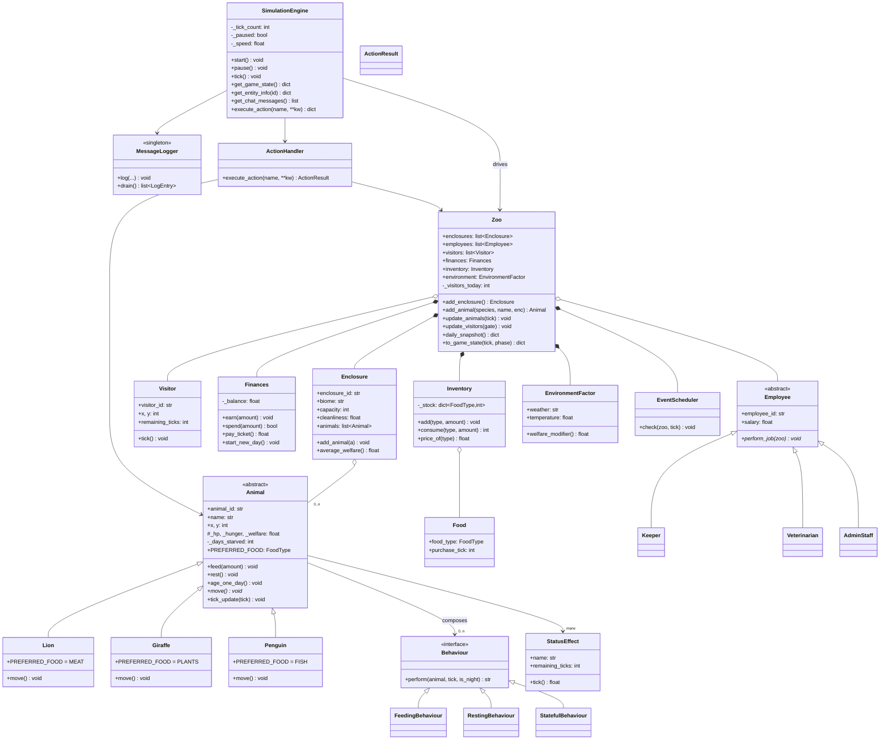

# Backend — UML Class Diagram (Mermaid)

This diagram covers the backend core domain. Arrows point from the *using*
class to the *used* class.

**Legend**

* `#` private, `+` public, `<<abstract>>` abstract class, `*--` composition
  (strong ownership), `o--` aggregation (looser), `<|--` inheritance.
* `Animal` is polymorphic: the OOP course chapter 2 requirement
  (fressen / schlafen / bewegen / altern) maps to `feed`, `rest`, `move`,
  `age_one_day`.
* `Behaviour` is the strategy pattern; `StatusEffect` is a plain value object.
* `Zoo` is the aggregate root (composition per chapter 1).
