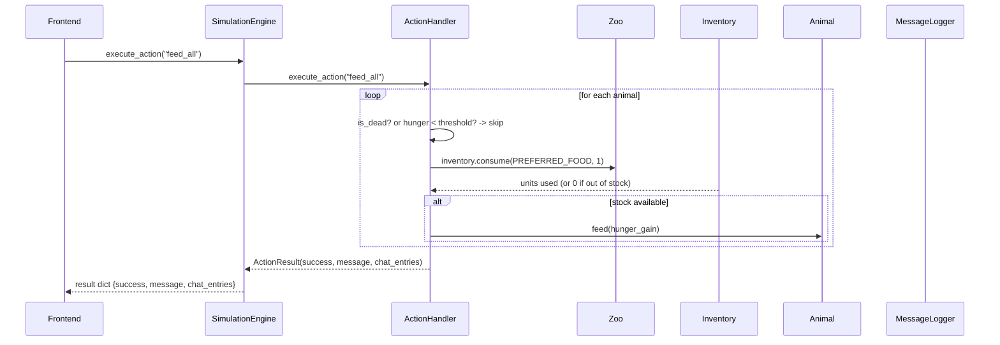
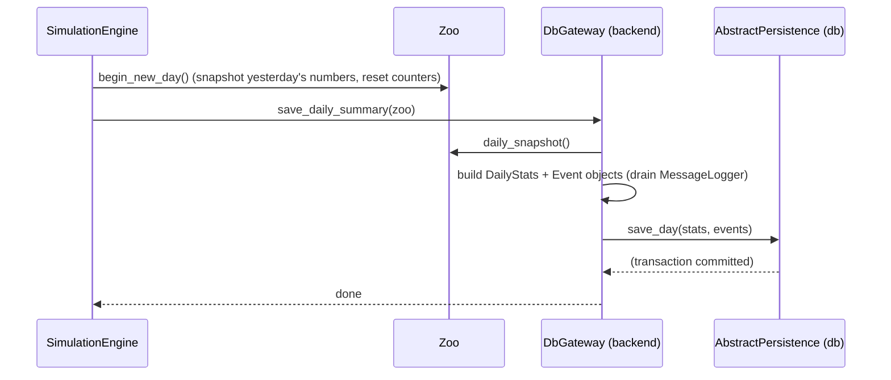

# Backend — Sequence Diagrams (Mermaid)

## 1. The tick loop

How `SimulationEngine.tick()` advances the whole zoo once. The frontend does
not call this directly in production (a background thread does via `start()`),
but each call is one logic step.

```mermaid
sequenceDiagram
    participant FE as Frontend (PyQt)
    participant E as SimulationEngine
    participant Z as Zoo
    participant A as Animal
    participant V as Visitor
    participant S as Staff (Employee)
    participant F as Finances
    participant L as MessageLogger

    FE->>E: start()  (background thread)
    loop every frame
        E->>E: tick_count++ , phase = MORNING..NIGHT
        E->>Z: update_animals(tick)
        Z->>A: tick_update(tick)
        A->>A: move() + hunger rises / status effects / welfare
        A-->>Z: (removed if died; death logged)
        Z-->>L: log("ERROR", "... died")
        E->>Z: update_visitors(gate)
        Z->>V: tick() ...
        V-->>F: pay_ticket()  (if spawned)
        alt day boundary reached (tick % 480 == 0)
            E->>Z: begin_new_day()
            E->>db_gateway: save_daily_summary(zoo)   (if persistence attached)
            db_gateway-->>Z: call AbstractPersistence.save_day(stats, events)
        end
        FE->>E: get_game_state()  (poll)
        E-->>FE: dict snapshot (system, finances, inventory, map)
    end
```

## 2. A player action ("God mode")

How the frontend triggers `execute_action("feed_all")` and what the backend
returns.



## 3. Day-end persistence to the database

Shows the single seam between backend domain and the `db` module.


