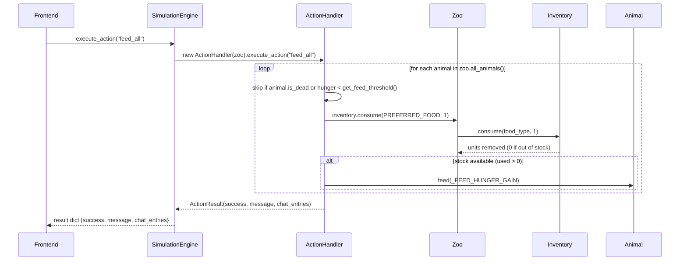
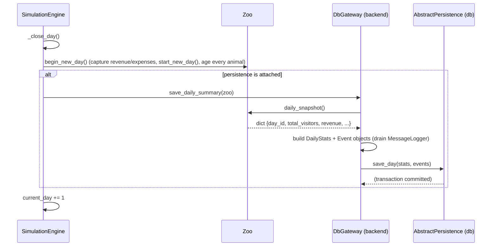

# Backend — Sequence Diagrams (Mermaid)

Drawn from the real implementation in `backend/core/`. Three runtime flows
that the class diagram cannot show: the tick loop, a "God mode" player action,
and the day-end persistence seam.

## 1. The tick loop

How `SimulationEngine.tick()` advances the whole zoo once. In production the
frontend does **not** call `tick()` directly — a background thread does via
`start()` — but each call is exactly one logic step.

```mermaid
sequenceDiagram
    participant FE as Frontend (PyQt)
    participant E as SimulationEngine
    participant Z as Zoo
    participant A as Animal
    participant V as Visitor
    participant S as Employee
    participant SCH as EventScheduler
    participant L as MessageLogger

    FE->>E: start()  (spawns daemon thread running _run())
    loop every frame (unless paused)
        E->>E: tick_count += 1 ; phase = _phase_of(tick)
        alt phase == NIGHT
            E->>Z: is_open = False
        else
            E->>Z: is_open = True
        end
        E->>Z: update_animals(tick, is_night)
        loop each enclosure -> each animal
            Z->>Z: enclosure.tick_update(tick)  (throttled cleanliness decay)
            Z->>A: tick_update(tick, is_night)
            A->>A: move() ; (throttled) hunger/welfare/effects
            A->>A: act(tick, is_night) -> behaviour strategy ; "rest" applies rest()
            A->>A: starvation check
            alt animal died
                Z->>L: log("ERROR", "... has died")
            else
                Z->>Z: keeps survival list
            end
        end
        E->>Z: update_visitors((50, 50))
        loop each visitor
            Z->>V: tick()  (move + lifetime--)
            V-->>Z: (removed if is_leaving())
        end
        opt zoo is open and random.p < 0.2 * visitor_multiplier
            Z->>Z: _spawn_visitor(gate, 24)
            Z->>Z: finances.pay_ticket()  (revenue_today += ticket_price)
        end
        E->>Z: update_staff(tick)
        opt every 20 ticks
            loop each employee
                Z->>S: perform_job(zoo)
            end
        end
        E->>SCH: check(zoo, tick)
        SCH-->>L: (random weather / illness event logged)
        alt day boundary reached (tick % 480 == 0)
            E->>E: _close_day()
        end
        FE->>E: get_game_state()  (poll each render frame)
        E-->>FE: dict snapshot {system, finances, inventory, animals/visitors_on_map}
    end
```

## 2. A player action ("God mode")

How the frontend triggers `execute_action("feed_all")` and what the backend
returns. `SimulationEngine.execute_action` builds an `ActionHandler` bound to
the zoo and returns its `ActionResult.to_dict()`.



## 3. Day-end persistence to the database

Shows the single seam between backend domain and the `db` module. Called from
`SimulationEngine._close_day()` when `tick % 480 == 0` and a `DbGateway` is
attached.



