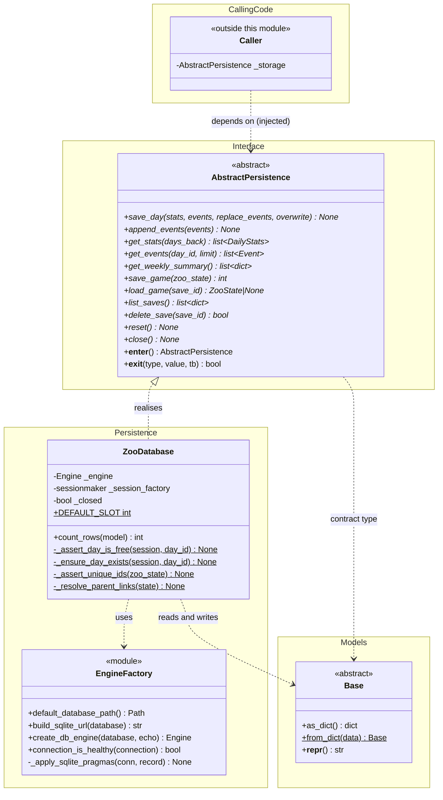
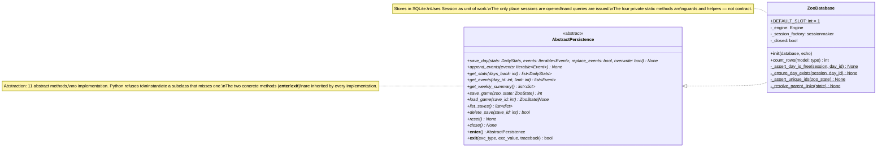
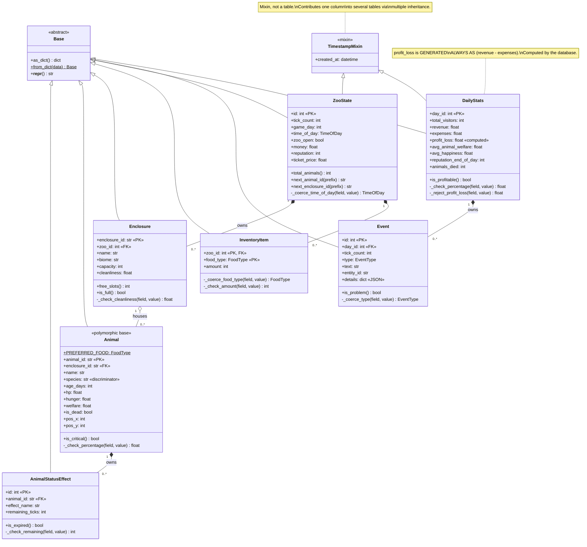
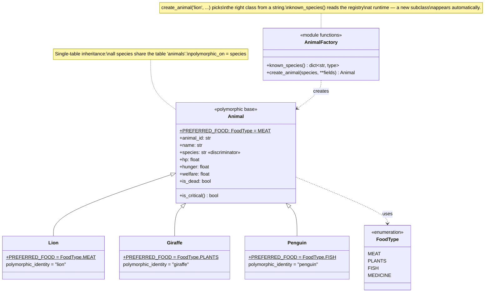
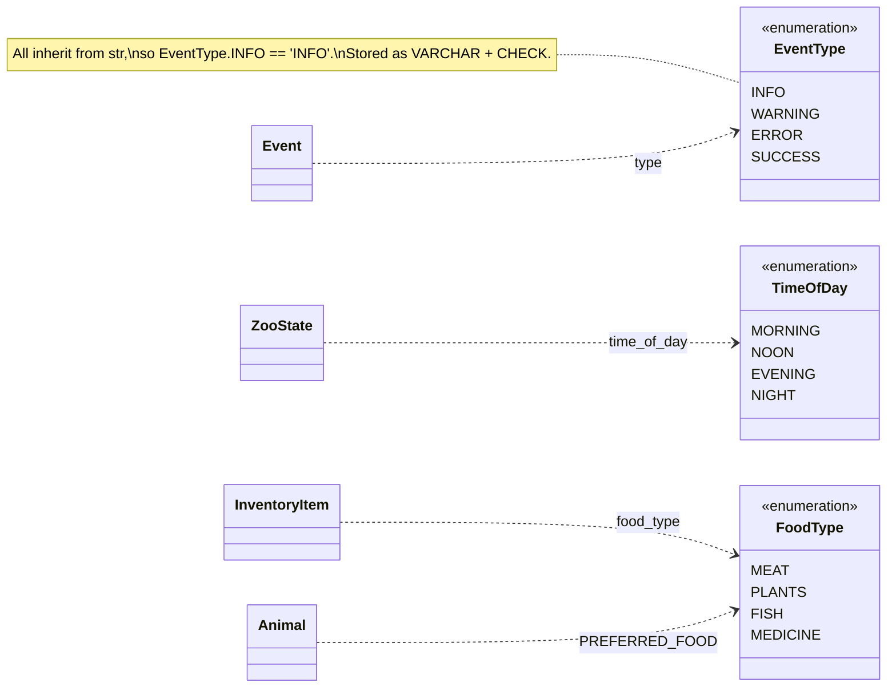

# UML Class Diagrams — Database Module

> **Authorship.** Drafted with AI assistance and completed under a
> human-in-the-loop process: reviewed, executed and reconciled with
> [`planning/db_planning/db_requirements.md`](../../planning/db_planning/db_requirements.md) before being
> committed. The process record — including the ten defects that review
> caught — is in [`ai_usage.md`](ai_usage.md).

All diagrams are Mermaid and render directly on GitHub and in VS Code
(extension *Markdown Preview Mermaid Support*).

Five diagrams, each answering one question:

1. [The complete picture](#1-overview) — how everything fits together
2. [The interface](#2-interface-and-implementations) — abstraction and polymorphism
3. [The models](#3-domain-model) — inheritance, composition, aggregation
4. [The animal hierarchy](#4-animal-hierarchy) — polymorphism in detail
5. [The enumerations](#5-enumerations) — the shared value sets

These describe the **object model**: Python classes, their methods and how they
relate. For the same seven tables seen as a *database* — column types, keys,
constraints, indexes and the generated DDL — see
[`uml_db_schema.md`](uml_db_schema.md) and [`uml_er_diagram.md`](uml_er_diagram.md).

---

## 1. Overview

The layering, and the direction dependencies are allowed to run.



**What to read out of it:** the calling code has a dashed arrow to
`AbstractPersistence` — a dependency, not ownership. It receives the storage
object rather than constructing one, and it is typed against the abstract
class, so it never learns which implementation it got. Everything inside the
solid boxes belongs to this module.

---

## 2. Interface and implementations

Zoomed in on the abstraction. Every operation of the contract is abstract
(`*`). There is exactly one implementation, `ZooDatabase`, and it adds exactly
one public method the interface does not declare — `count_rows`, a diagnostic
helper for tests and demos rather than part of the contract.



**Why the split matters:** callers are typed against the left-hand box and
never mention the right-hand one. Swapping the storage layer, or handing a
test an in-memory database, changes one line and nothing else.

---

## 3. Domain model

The seven tables and how they relate. Note the two kinds of diamond:

- **filled (`*--`) = composition** — the child cannot exist without the
  parent and dies with it (`cascade="all, delete-orphan"`)
- **hollow (`o--`) = aggregation** — a looser has-a relationship



**Composition vs aggregation, concretely:** deleting a `ZooState` deletes its
enclosures, and deleting an `Enclosure` deletes its animals — but an animal
is *housed in* an enclosure rather than being a body part of it, which is why
that edge is drawn as aggregation. In the schema both are `ON DELETE
CASCADE`; the distinction is one of meaning.

---

## 4. Animal hierarchy

The polymorphic part. All species live in one table; the `species` column
tells SQLAlchemy which class to build.



**Why it matters in practice:**

```python
animals = session.scalars(select(Animal)).all()
# -> [Lion, Giraffe, Penguin, ...] — not [Animal, Animal, Animal]

for animal in animals:
    print(animal.PREFERRED_FOOD)   # MEAT / PLANTS / FISH
```

No `if species == "lion"` chain anywhere. Adding a species is three lines and
changes nothing else.

---

## 5. Enumerations


