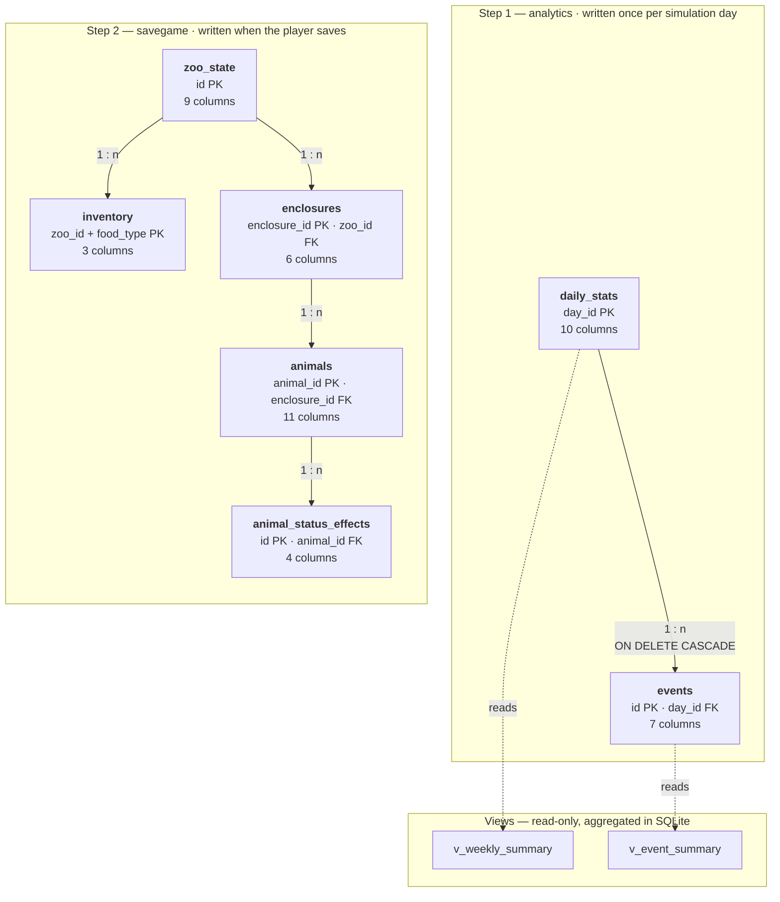
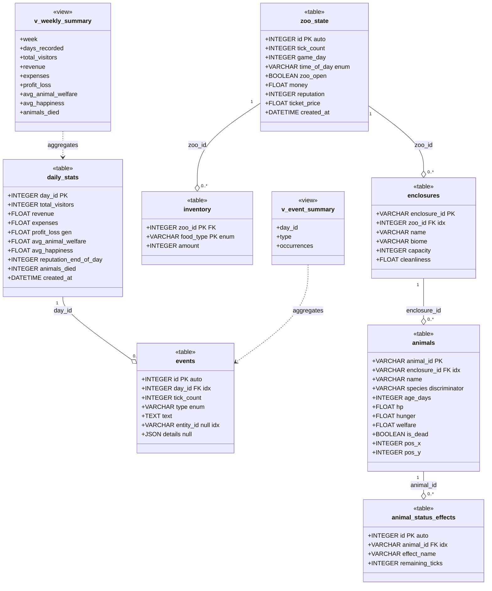

# Database Schema — UML Diagram and DDL

> **Authorship.** Drafted with AI assistance and completed under a
> human-in-the-loop process: reviewed, executed and reconciled with
> [`planning/db_planning/db_requirements.md`](../../planning/db_planning/db_requirements.md) before being
> committed. The process record — including the ten defects that review
> caught — is in [`ai_usage.md`](ai_usage.md).

The physical database schema: seven tables, two views, every column type, key
and constraint.

**Three diagram documents, three questions.** This one describes the *database*.
[`uml_class_diagram.md`](uml_class_diagram.md) describes the *Python objects*
that map onto it, and [`uml_er_diagram.md`](uml_er_diagram.md) describes the
*relationships* between the tables, with the reasoning behind the indexes and
views. They overlap on purpose — the same seven tables seen three ways.

The last section is the **DDL SQLite actually generates**, dumped from a fresh
database. If the diagram and the dump ever disagree, the dump is right.

1. [The schema at a glance](#1-the-schema-at-a-glance)
2. [Full schema diagram](#2-full-schema-diagram)
3. [Type mapping](#3-type-mapping)
4. [Keys and constraints](#4-keys-and-constraints)
5. [The generated DDL](#5-the-generated-ddl)

---

## 1. The schema at a glance

Two independent groups, mirroring the two steps of the requirements. Nothing
connects them — that is deliberate, not an oversight.



A zoo with no savegame still has a complete history of figures, and a savegame
does not require any day to have been recorded. Mixing the two up is the
easiest mistake to make against this module — see
[`usage.md`](usage.md), section "What goes where".

---

## 2. Full schema diagram

Every table as a UML class with the SQL type of each column and its role.

**Legend.** `PK` primary key · `FK` foreign key · `idx` indexed · `auto`
assigned by the database · `gen` computed by the database · `enum` restricted
by a `CHECK` to a fixed value set · `null` nullable (every other **stored**
column is `NOT NULL`; the generated `profit_loss` carries no `NOT NULL` in the
DDL, by construction).

Column lengths and the exact constraint expressions are deliberately not in the
boxes — they are in [§4](#4-keys-and-constraints) and in the
[DDL](#5-the-generated-ddl), where they can be read without squinting.



**Reading the diagram:** every relationship is one-to-many with
`ON DELETE CASCADE`, so each solid arrow is also a deletion path — delete the
parent and the children go with it.

`species` is marked as a discriminator because SQLAlchemy reads it to decide
which Python class a row becomes: `Lion`, `Giraffe` or `Penguin`. Adding a
species therefore needs no schema change at all, which is why the column is a
plain `VARCHAR` and not an enum.

The two views are drawn with dashed arrows because they are dependencies, not
ownership: they hold no data of their own and disappear from the picture the
moment the tables they read do.

---

## 3. Type mapping

Three type systems meet in this module. The mapping is worth stating, because
none of the three uses quite the same names.

| Python | SQLAlchemy | SQLite column | Notes |
|---|---|---|---|
| `int` | `Integer` | `INTEGER` | |
| `float` | `Float` | `FLOAT` | SQLite stores it as `REAL` |
| `str` | `String(n)` | `VARCHAR(n)` | SQLite does not enforce the length; it documents intent |
| `str` (long) | `Text` | `TEXT` | Used for `events.text`, which has no sensible limit |
| `bool` | `Boolean` | `BOOLEAN` | Stored as `0` / `1` |
| `datetime` | `DateTime` | `DATETIME` | Wall-clock time, not simulation time |
| `dict` | `JSON` | `JSON` | Serialised on write, parsed on read |
| `Enum` | `Enum(..., native_enum=False)` | `VARCHAR(16)` + `CHECK` | Readable text, not opaque integers |

**Why enums are text rather than integers.** `SELECT * FROM events` is
meaningful without a lookup table: the column literally says `WARNING`. The
`CHECK` constraint keeps the set closed, so readability costs no integrity.

> **This required an explicit flag.** In SQLAlchemy 2.0 `create_constraint`
> defaults to **False**, so `Enum(..., native_enum=False)` alone produces a bare
> `VARCHAR` and any string is accepted by the file. The three enum columns pass
> `create_constraint=True` for exactly this reason. It is easy to miss, and the
> symptom — a database that quietly accepts `type='PANIC'` when edited by hand
> — never appears while the application is the only writer.

---

## 4. Keys and constraints

### Primary keys

| Table | Primary key | Assigned by | Why |
|---|---|---|---|
| `daily_stats` | `day_id` | the caller | It *is* the simulation day number; auto-incrementing it would invent a second numbering |
| `events` | `id` | the database | A message needs no meaningful identity of its own |
| `zoo_state` | `id` | the database | The save slot number |
| `inventory` | `zoo_id` + `food_type` | — | **Composite.** Makes it structurally impossible for one save to hold `MEAT` twice |
| `enclosures` | `enclosure_id` | the caller | Text like `"e_01"`; the simulation needs it before anything is stored |
| `animals` | `animal_id` | the caller | Text like `"a_01"`; a message can reference it on the first tick |
| `animal_status_effects` | `id` | the database | |

Caller-assigned identifiers are not an oversight. The simulation needs an
identifier **before** the first write — a log message can carry
`entity_id="a_01"` hours before any save. Use `ZooState.next_animal_id()` to
obtain a free one; a counter that restarts at `1` after a load hands out
duplicates, which `save_game()` refuses.

### Foreign keys

All five are `ON DELETE CASCADE`:

| Child | Column | Parent |
|---|---|---|
| `events` | `day_id` | `daily_stats.day_id` |
| `inventory` | `zoo_id` | `zoo_state.id` |
| `enclosures` | `zoo_id` | `zoo_state.id` |
| `animals` | `enclosure_id` | `enclosures.enclosure_id` |
| `animal_status_effects` | `animal_id` | `animals.animal_id` |

> **They only work because `PRAGMA foreign_keys=ON` is set on every
> connection.** SQLite ignores foreign keys by default, per connection, every
> time. Without it the cascades would be decorative and deleting a save would
> leave orphaned animals behind. The pragma is applied in
> `persistence/engine_factory.py`.

### CHECK constraints

Eighteen in total: fifteen range and sign checks, three enum value sets.

| Table | Constraints |
|---|---|
| `daily_stats` | `avg_animal_welfare` and `avg_happiness` in 0–100; `total_visitors` and `animals_died` non-negative |
| `events` | `type` ∈ {INFO, WARNING, ERROR, SUCCESS} |
| `zoo_state` | `tick_count`, `game_day`, `ticket_price` non-negative; `time_of_day` ∈ {MORNING, NOON, EVENING, NIGHT} |
| `inventory` | `amount` non-negative; `food_type` ∈ {MEAT, PLANTS, FISH, MEDICINE} |
| `enclosures` | `cleanliness` in 0–100; `capacity` non-negative |
| `animals` | `hp`, `hunger`, `welfare` in 0–100; `age_days` non-negative |
| `animal_status_effects` | `remaining_ticks` non-negative |

**These duplicate the Python `@validates` hooks on purpose.** The two guard
different threats: the validator catches bugs in our own code at the moment of
assignment and produces a readable message; the constraint protects the *file*,
and still holds when someone opens the database in a SQLite browser and edits a
row by hand. Demonstrably:

```
sqlite> INSERT INTO events (day_id, tick_count, type, text)
   ...> VALUES (1, 0, 'PANIC', 'x');
Error: CHECK constraint failed: ck_events_type
```

### The generated column

```sql
profit_loss FLOAT GENERATED ALWAYS AS (revenue - expenses)
```

The **database** computes it, so it can never contradict the two values it
derives from. Two consequences for callers: it must not be passed to the
constructor (doing so raises), and it is `None` until the row has been read back
from the database.

### Indexes

Beyond the automatic primary key indexes, five — each matching an access path
the code actually uses, none speculative:

| Index | Table | Column | Used by |
|---|---|---|---|
| `ix_events_day_id` | `events` | `day_id` | `get_events(day_id=...)` |
| `ix_events_entity_id` | `events` | `entity_id` | "show everything about this animal" |
| `ix_enclosures_zoo_id` | `enclosures` | `zoo_id` | `load_game()` |
| `ix_animals_enclosure_id` | `animals` | `enclosure_id` | `load_game()` |
| `ix_animal_status_effects_animal_id` | `animal_status_effects` | `animal_id` | `load_game()` |

---

## 5. The generated DDL

Nobody wrote a `CREATE TABLE` by hand. The schema below is produced from the
model classes by `Base.metadata.create_all()` and dumped straight out of a
fresh database — this is the ground truth the diagrams above describe.

Reproduce it yourself:

```bash
python -m db.demo data/demo.sqlite && sqlite3 data/demo.sqlite .schema
```

```sql
CREATE TABLE daily_stats (
	day_id INTEGER NOT NULL,
	total_visitors INTEGER NOT NULL,
	revenue FLOAT NOT NULL,
	expenses FLOAT NOT NULL,
	profit_loss FLOAT GENERATED ALWAYS AS (revenue - expenses),
	avg_animal_welfare FLOAT NOT NULL,
	avg_happiness FLOAT NOT NULL,
	reputation_end_of_day INTEGER NOT NULL,
	animals_died INTEGER NOT NULL,
	created_at DATETIME NOT NULL,
	PRIMARY KEY (day_id),
	CONSTRAINT ck_daily_stats_welfare CHECK (avg_animal_welfare BETWEEN 0 AND 100),
	CONSTRAINT ck_daily_stats_happiness CHECK (avg_happiness BETWEEN 0 AND 100),
	CONSTRAINT ck_daily_stats_visitors CHECK (total_visitors >= 0),
	CONSTRAINT ck_daily_stats_deaths CHECK (animals_died >= 0)
);

CREATE TABLE events (
	id INTEGER NOT NULL,
	day_id INTEGER NOT NULL,
	tick_count INTEGER NOT NULL,
	type VARCHAR(16) NOT NULL,
	text TEXT NOT NULL,
	entity_id VARCHAR(50),
	details JSON,
	PRIMARY KEY (id),
	FOREIGN KEY(day_id) REFERENCES daily_stats (day_id) ON DELETE CASCADE,
	CONSTRAINT ck_events_type CHECK (type IN ('INFO', 'WARNING', 'ERROR', 'SUCCESS'))
);

CREATE TABLE zoo_state (
	id INTEGER NOT NULL,
	tick_count INTEGER NOT NULL,
	game_day INTEGER NOT NULL,
	time_of_day VARCHAR(16) NOT NULL,
	zoo_open BOOLEAN NOT NULL,
	money FLOAT NOT NULL,
	reputation INTEGER NOT NULL,
	ticket_price FLOAT NOT NULL,
	created_at DATETIME NOT NULL,
	PRIMARY KEY (id),
	CONSTRAINT ck_zoo_state_tick CHECK (tick_count >= 0),
	CONSTRAINT ck_zoo_state_day CHECK (game_day >= 0),
	CONSTRAINT ck_zoo_state_price CHECK (ticket_price >= 0),
	CONSTRAINT ck_zoo_state_time_of_day
	    CHECK (time_of_day IN ('MORNING', 'NOON', 'EVENING', 'NIGHT'))
);

CREATE TABLE inventory (
	zoo_id INTEGER NOT NULL,
	food_type VARCHAR(16) NOT NULL,
	amount INTEGER NOT NULL,
	PRIMARY KEY (zoo_id, food_type),
	CONSTRAINT ck_inventory_amount CHECK (amount >= 0),
	FOREIGN KEY(zoo_id) REFERENCES zoo_state (id) ON DELETE CASCADE,
	CONSTRAINT ck_inventory_food_type
	    CHECK (food_type IN ('MEAT', 'PLANTS', 'FISH', 'MEDICINE'))
);

CREATE TABLE enclosures (
	enclosure_id VARCHAR(20) NOT NULL,
	zoo_id INTEGER NOT NULL,
	name VARCHAR(80) NOT NULL,
	biome VARCHAR(40) NOT NULL,
	capacity INTEGER NOT NULL,
	cleanliness FLOAT NOT NULL,
	PRIMARY KEY (enclosure_id),
	CONSTRAINT ck_enclosure_clean CHECK (cleanliness BETWEEN 0 AND 100),
	CONSTRAINT ck_enclosure_capacity CHECK (capacity >= 0),
	FOREIGN KEY(zoo_id) REFERENCES zoo_state (id) ON DELETE CASCADE
);

CREATE TABLE animals (
	animal_id VARCHAR(20) NOT NULL,
	enclosure_id VARCHAR(20) NOT NULL,
	name VARCHAR(80) NOT NULL,
	species VARCHAR(30) NOT NULL,
	age_days INTEGER NOT NULL,
	hp FLOAT NOT NULL,
	hunger FLOAT NOT NULL,
	welfare FLOAT NOT NULL,
	is_dead BOOLEAN NOT NULL,
	pos_x INTEGER NOT NULL,
	pos_y INTEGER NOT NULL,
	PRIMARY KEY (animal_id),
	CONSTRAINT ck_animal_hp CHECK (hp BETWEEN 0 AND 100),
	CONSTRAINT ck_animal_hunger CHECK (hunger BETWEEN 0 AND 100),
	CONSTRAINT ck_animal_welfare CHECK (welfare BETWEEN 0 AND 100),
	CONSTRAINT ck_animal_age CHECK (age_days >= 0),
	FOREIGN KEY(enclosure_id) REFERENCES enclosures (enclosure_id) ON DELETE CASCADE
);

CREATE TABLE animal_status_effects (
	id INTEGER NOT NULL,
	animal_id VARCHAR(20) NOT NULL,
	effect_name VARCHAR(60) NOT NULL,
	remaining_ticks INTEGER NOT NULL,
	PRIMARY KEY (id),
	CONSTRAINT ck_effect_remaining CHECK (remaining_ticks >= 0),
	FOREIGN KEY(animal_id) REFERENCES animals (animal_id) ON DELETE CASCADE
);

CREATE INDEX ix_events_day_id ON events (day_id);
CREATE INDEX ix_events_entity_id ON events (entity_id);
CREATE INDEX ix_enclosures_zoo_id ON enclosures (zoo_id);
CREATE INDEX ix_animals_enclosure_id ON animals (enclosure_id);
CREATE INDEX ix_animal_status_effects_animal_id
    ON animal_status_effects (animal_id);

CREATE VIEW v_weekly_summary AS
SELECT
    (day_id - 1) / 7 + 1         AS week,
    COUNT(*)                     AS days_recorded,
    SUM(total_visitors)          AS total_visitors,
    SUM(revenue)                 AS revenue,
    SUM(expenses)                AS expenses,
    SUM(revenue) - SUM(expenses) AS profit_loss,
    AVG(avg_animal_welfare)      AS avg_animal_welfare,
    AVG(avg_happiness)           AS avg_happiness,
    SUM(animals_died)            AS animals_died
FROM daily_stats
GROUP BY (day_id - 1) / 7;

CREATE VIEW v_event_summary AS
SELECT
    day_id,
    type,
    COUNT(*) AS occurrences
FROM events
GROUP BY day_id, type;
```

Only the whitespace has been normalised — no column, type or constraint was
edited.

### Schema changes need a fresh database

There is no migration tool; Alembic would be disproportionate for a module this
size. After changing a model, delete `data/zoo.sqlite` or call `reset()`.

Worth stating explicitly because **extending an enum counts as a schema
change**: the value list is baked into the `CHECK` constraint, and
`CREATE TABLE IF NOT EXISTS` will not alter an existing table to match.

---

## Where to look next

| Document | Contents |
|---|---|
| [`uml_er_diagram.md`](uml_er_diagram.md) | The same tables as relationships, plus the reasoning behind views, indexes and data volume |
| [`uml_class_diagram.md`](uml_class_diagram.md) | The Python classes that map onto this schema |
| [`architecture.md`](architecture.md) | Why SQLite, why an ORM, when data is written, known limitations |
| [`usage.md`](usage.md) | How to fill these tables from calling code |
