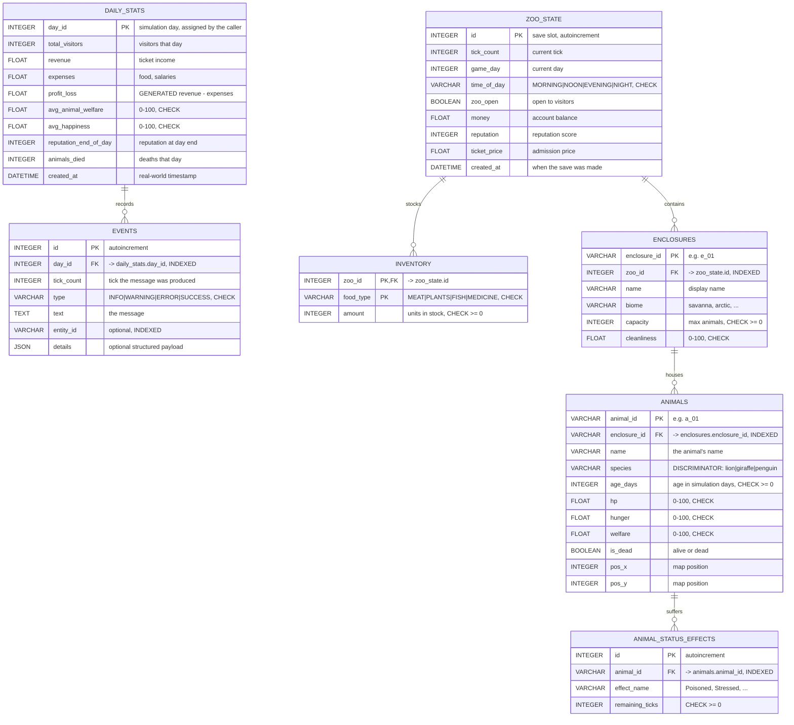
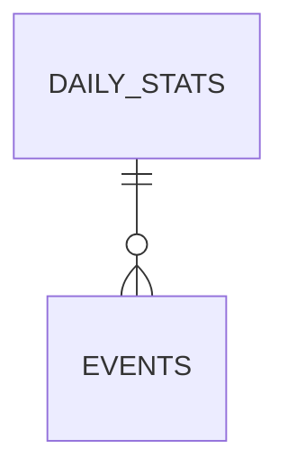
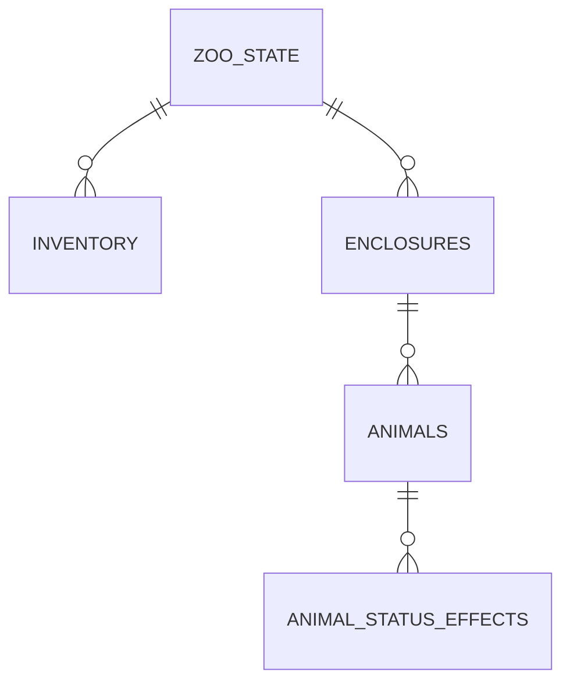

# ER Diagram — Database Schema

> **Authorship.** Drafted with AI assistance and completed under a
> human-in-the-loop process: reviewed, executed and reconciled with
> [`planning/db_planning/db_requirements.md`](../../planning/db_planning/db_requirements.md) before being
> committed. The process record — including the ten defects that review
> caught — is in [`ai_usage.md`](ai_usage.md).

The seven tables as they exist in `data/zoo.sqlite`, with every column, type and
key — and, below that, the parts a bare schema listing does not tell you: how
the cascades behave, what the views are for, which indexes exist and why, and
how much data actually accumulates.

> For the same schema drawn as a **UML class diagram**, with the constraint
> expressions written out and the generated `CREATE TABLE` statements, see
> [`uml_db_schema.md`](uml_db_schema.md). This document is the relational view;
> that one is the physical view.

---

## Complete schema



---

## Two independent groups

The schema splits cleanly in two, which mirrors the two-step plan:



**Step 1 — analytics.** Written once per simulation day, feeds the charts and
the chat log. Independent of savegames: a zoo with no save still has a full
history.



**Step 2 — savegame.** Written only when the player saves. A four-level tree
hanging off one root, which is why saving is a single call: the cascades
carry the rest.

---

## Cascade behaviour

Every foreign key is declared `ON DELETE CASCADE`, so deleting a row deletes
everything that depends on it:

```
DELETE FROM zoo_state WHERE id = 1
    -> deletes its inventory rows
    -> deletes its enclosures
        -> deletes those enclosures' animals
            -> deletes those animals' status effects

DELETE FROM daily_stats WHERE day_id = 3
    -> deletes that day's events
```

> **This only works because `PRAGMA foreign_keys=ON` is set on every
> connection.** SQLite ignores foreign keys by default. The setting is applied
> in `persistence/engine_factory.py`; without it the cascades above would
> silently do nothing and orphaned rows would accumulate.

---

## Views

Two read-only views ship with the schema. They are created automatically
alongside the tables.

### `v_weekly_summary`

Groups `daily_stats` into weeks of seven days. Week 1 covers days 1–7.

| Column | Meaning |
|---|---|
| `week` | week number, starting at 1 |
| `days_recorded` | days actually stored in that week (a partial week is reported, not dropped) |
| `total_visitors` | sum over the week |
| `revenue` | sum over the week |
| `expenses` | sum over the week |
| `profit_loss` | `revenue - expenses` |
| `avg_animal_welfare` | mean over the recorded days |
| `avg_happiness` | mean over the recorded days |
| `animals_died` | sum over the week |

Read through `get_weekly_summary()`. Plotting 200 individual days is
unreadable; this makes long-range charts practical, and the aggregation runs
inside SQLite.

### `v_event_summary`

Counts messages per day and type, so a caller can show "3 warnings, 1 error"
for a day without loading the messages themselves.

| Column | Meaning |
|---|---|
| `day_id` | the simulation day |
| `type` | `INFO`, `WARNING`, `ERROR` or `SUCCESS` |
| `occurrences` | how many messages of that type that day |

---

## Indexes

Beyond the automatic primary key indexes:

| Table | Column | Why |
|---|---|---|
| `events` | `day_id` | `get_events(day_id=...)` filters on it |
| `events` | `entity_id` | "show everything about this animal" |
| `enclosures` | `zoo_id` | loading a savegame filters on it |
| `animals` | `enclosure_id` | loading enclosures filters on it |
| `animal_status_effects` | `animal_id` | loading animals filters on it |

Every index matches an access path the code actually uses — none are
speculative.

---

## Data volume

| Table | Rows after ~100 simulated days |
|---|---|
| `daily_stats` | 100 |
| `events` | ~5,000 |
| `zoo_state` | 1 |
| `inventory` | 3–4 |
| `enclosures` | ~5 |
| `animals` | ~50 |
| `animal_status_effects` | ~10 |

Roughly 5,000 rows in total. SQLite handles millions, so the schema is
nowhere near any limit.

---

## Inspecting the database by hand

```bash
sqlite3 data/zoo.sqlite
```

```sql
.tables
.schema daily_stats
SELECT * FROM daily_stats ORDER BY day_id;
SELECT * FROM v_weekly_summary;
SELECT species, COUNT(*) FROM animals GROUP BY species;
```

The schema is deliberately readable: enums are stored as text rather than
opaque integers, so every row means something without a lookup table.
