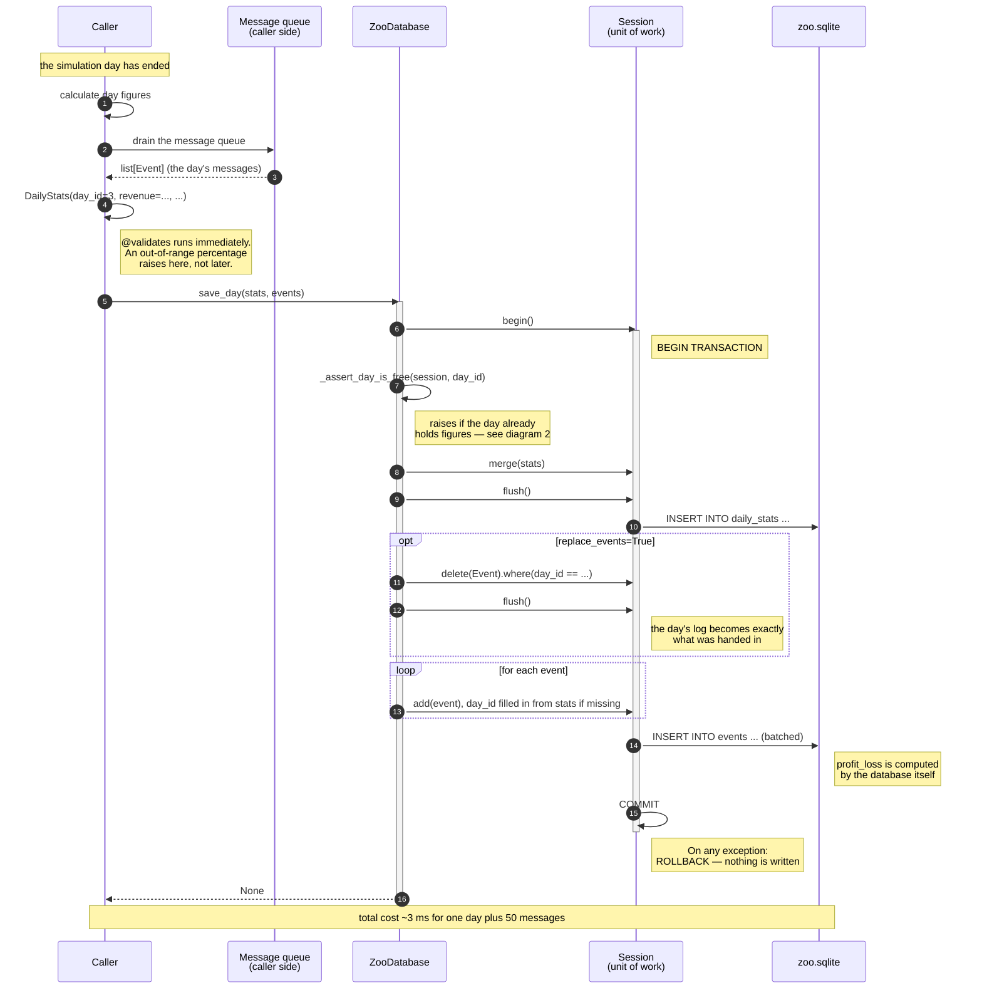
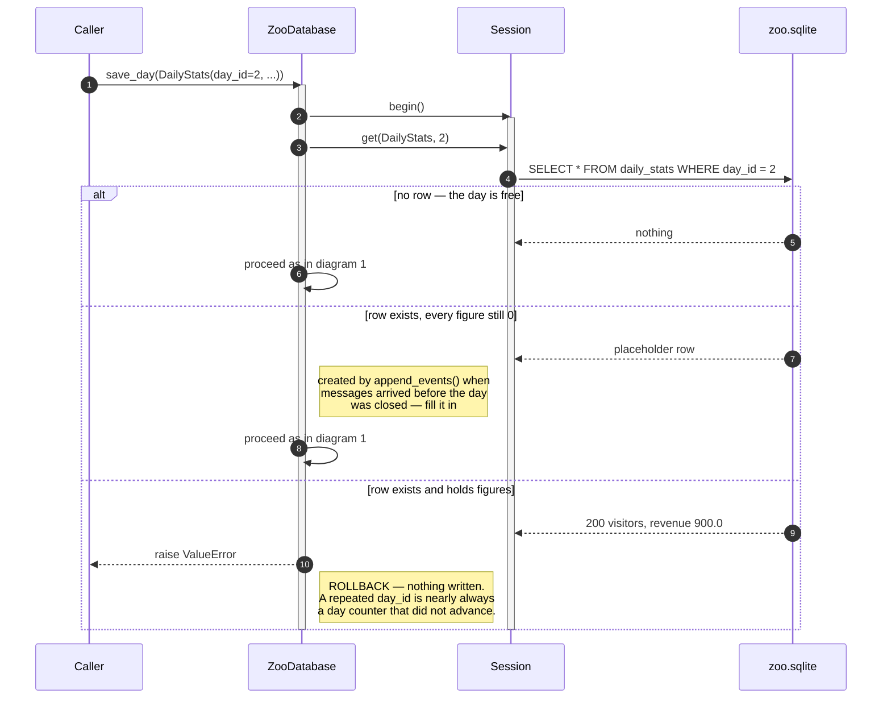
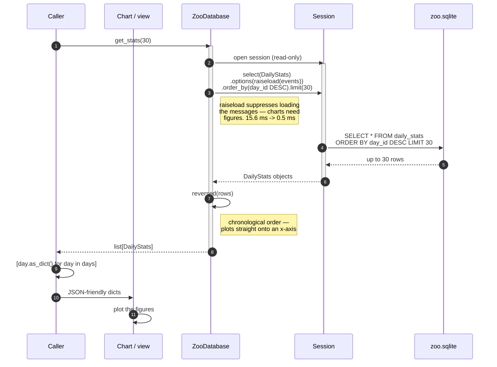
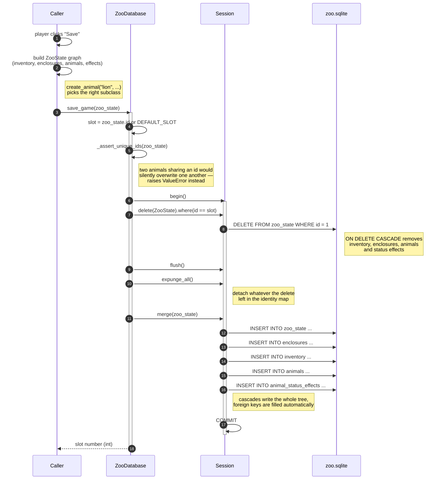
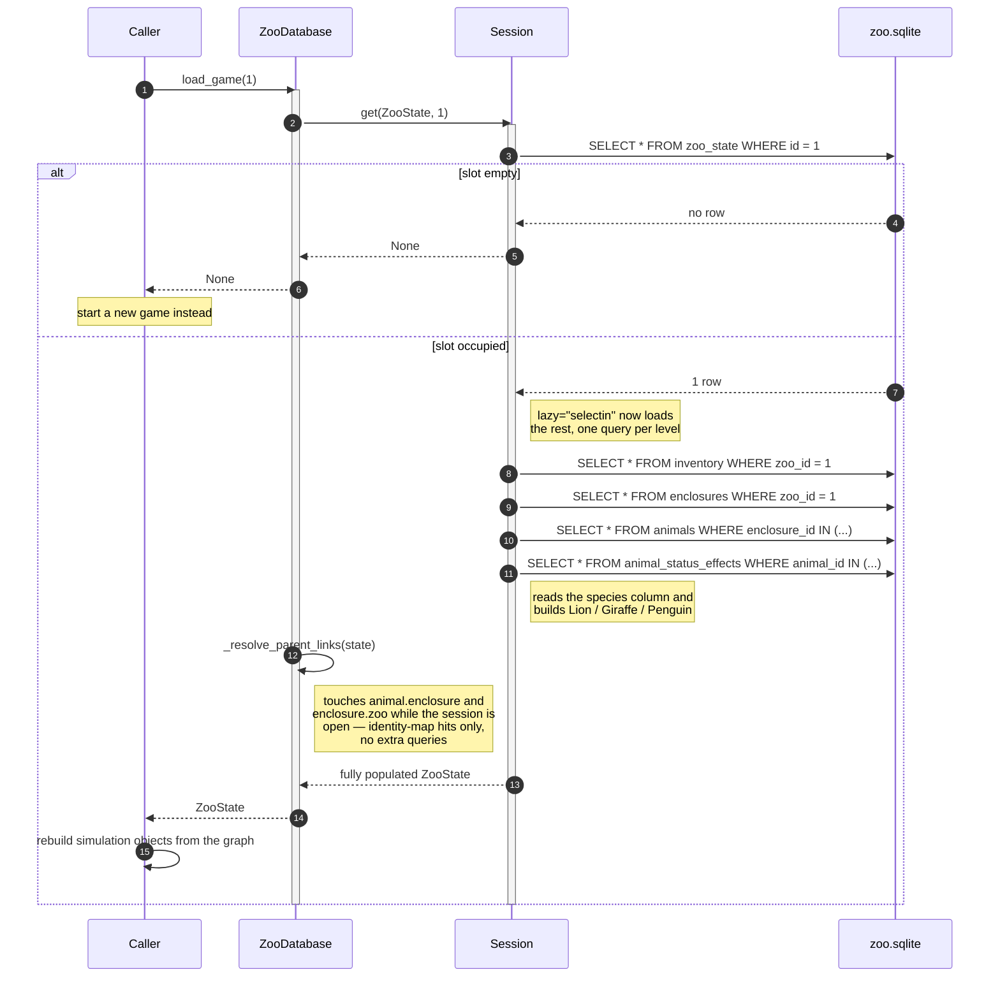
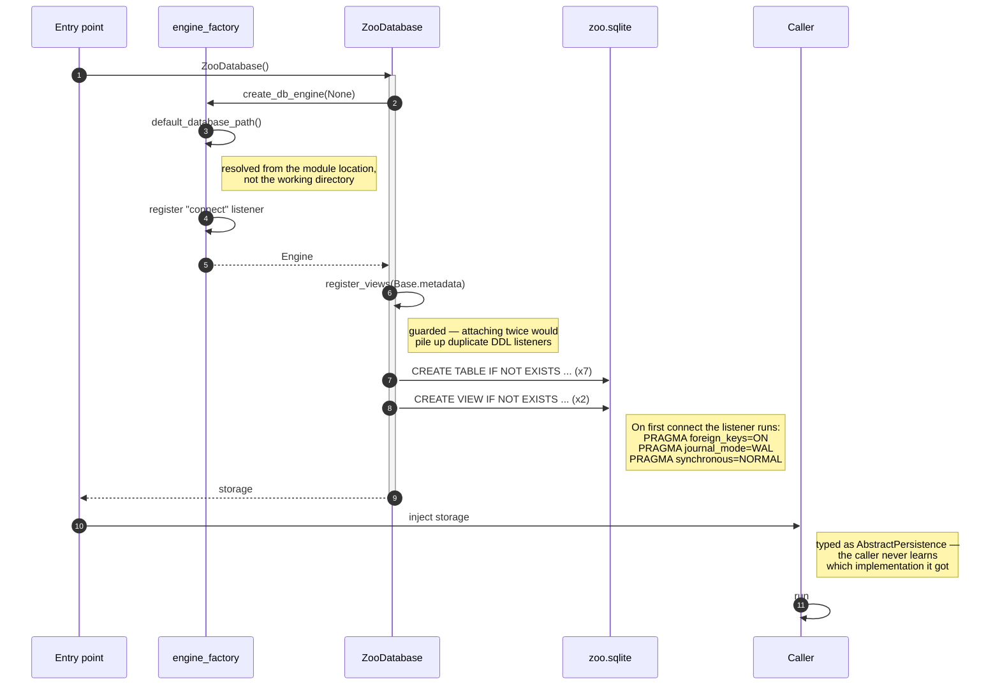

# Sequence Diagrams — Database Module

> **Authorship.** Drafted with AI assistance and completed under a
> human-in-the-loop process: reviewed, executed and reconciled with
> [`planning/db_planning/db_requirements.md`](../../planning/db_planning/db_requirements.md) before being
> committed. The process record — including the ten defects that review
> caught — is in [`ai_usage.md`](ai_usage.md).

Six interactions, from the first call down to the database file. Together they
cover every path through the module.

`Caller` stands for whatever code uses this module — in this project the
backend's `DbGateway`, but the module neither knows nor cares.

Every diagram is traced against the implementation: each step on a
`ZooDatabase` lifeline corresponds to a statement in
`persistence/zoo_database.py`, and steps on any other lifeline belong to the
participant they are drawn on. The table at the end names the exact method and
module each diagram was checked against, so the claim can be verified rather
than taken on trust.

1. [End of day — writing](#1-end-of-day)
2. [A repeated day is refused](#2-a-repeated-day-is-refused)
3. [Reading day summaries](#3-reading-day-summaries)
4. [Saving a game](#4-saving-a-game)
5. [Loading a game](#5-loading-a-game)
6. [Start-up](#6-start-up)

---

## 1. End of day

The most frequent write. Happens once per simulation day, never per tick.



**Key point:** day row and messages share one transaction. A crash mid-write
can never leave a day without its events, or events pointing at a day that does
not exist. Because a failed call writes *nothing*, retrying after an error is
safe.

**Messages append by default.** That is what lets `append_events()` flush the
queue during the day without the day-end call wiping those messages. Pass
`replace_events=True` for the opposite behaviour.

---

## 2. A repeated day is refused

Split out because it is the one call that can fail on input that looks
perfectly correct, and because the reason is not obvious from the signature.



**Why refuse rather than overwrite.** Overwriting is silently destructive in
two ways at once: the earlier day's figures disappear, *and* both days'
messages end up merged under one `day_id`. Nothing afterwards reveals that a
day went missing. `overwrite=True` is there for when replacing a day really is
intended.

Two cases deliberately stay unaffected:

- **Retrying a failed call.** A failed `save_day()` rolls back completely, so
  the day is still free and the retry just works.
- **Closing a day that already has messages.** The placeholder row created by
  `append_events()` counts as free and gets filled in normally.

> **One edge case, stated plainly.** A real day on which every figure happened
> to be zero is indistinguishable from a placeholder, so it carries no
> overwrite protection. Telling the two apart would need a marker column, which
> would change the agreed schema. See [`architecture.md`](architecture.md), §7.

---

## 3. Reading day summaries



**Key point:** the objects stay usable after the session closes
(`expire_on_commit=False`). Callers never have to think about sessions.

Reading `.events` on one of these results raises a clear SQLAlchemy error
rather than silently returning an empty list — `get_events()` is the way to
read messages.

---

## 4. Saving a game

One call writes a four-level object tree.



**Why delete before insert:** merging into the existing slot would leave behind
animals the player had sold or that had died. The save would slowly accumulate
ghosts. Delete and insert share one transaction, so an interrupted save cannot
destroy the old one.

**Why `merge()` and not `add()`:** the graph handed in has very often just come
back from `load_game()` — load, play, save is *the* normal cycle. Such a graph
still carries its database identity, so `add()` would treat it as an existing
row and emit `UPDATE` statements against rows this same transaction had just
deleted. `expunge_all()` followed by `merge()` handles a freshly built graph
and a loaded one identically.

---

## 5. Loading a game



**Key point:** the whole tree is loaded before the session closes, so the graph
can be walked freely afterwards — **in both directions**. `animal.enclosure`
works, not just `enclosure.animals`. Without `_resolve_parent_links` the upward
direction would raise `DetachedInstanceError`, because SQLAlchemy stops
eager-loading as soon as relationships form a cycle.

And `type(animal).__name__` really is `"Lion"` — the database resolved the
inheritance itself.

---

## 6. Start-up

The one moment storage is created. Everything after it is independent of which
implementation was chosen.



**Choosing the storage** is exactly one line, at the application's entry point:

```python
storage = ZooDatabase()             # normal operation -> data/zoo.sqlite
storage = ZooDatabase(":memory:")   # tests -> nothing on disk
```

Every arrow after that point stays identical, because everything downstream is
typed against `AbstractPersistence`.

---

## Where each diagram is traced from

| Diagram | Implementation it was checked against |
|---|---|
| 1. End of day | `ZooDatabase.save_day` |
| 2. A repeated day is refused | `ZooDatabase._assert_day_is_free` |
| 3. Reading day summaries | `ZooDatabase.get_stats` |
| 4. Saving a game | `ZooDatabase.save_game`, `_assert_unique_ids` |
| 5. Loading a game | `ZooDatabase.load_game`, `_resolve_parent_links` |
| 6. Start-up | `ZooDatabase.__init__`, `engine_factory`, `views` |

Every participant used in a diagram is declared in it — Mermaid would
otherwise invent one silently, which is how a diagram drifts away from the code
without anyone noticing.
