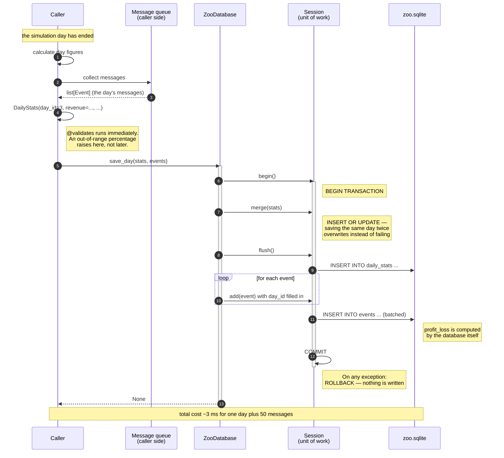
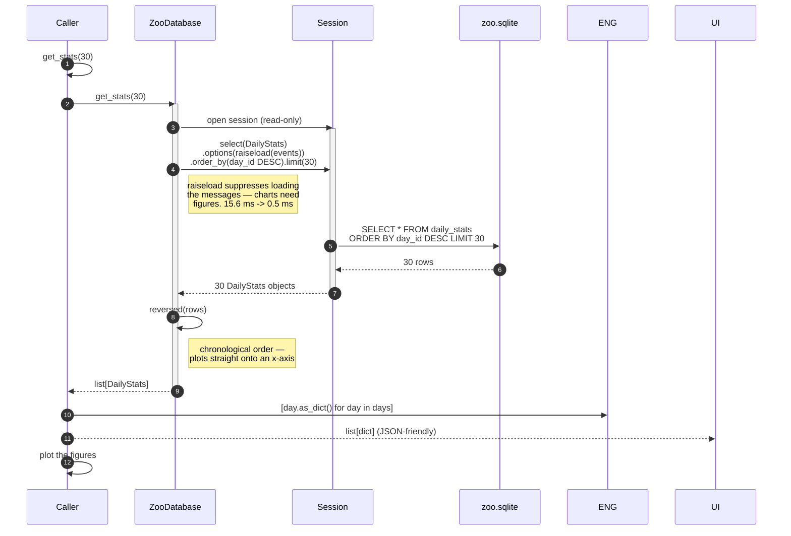
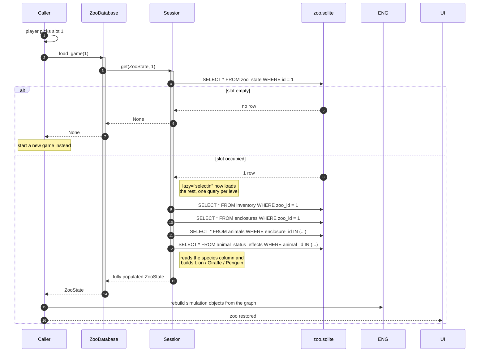
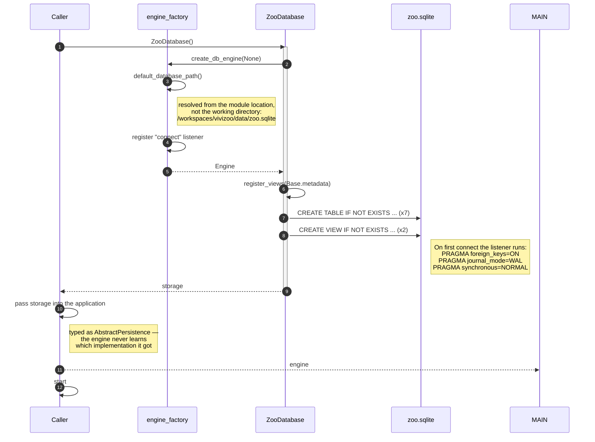

# Sequence Diagrams — Database Module

Five interactions, from the first call down to the database file. Together
they cover every path through the module.

`Caller` stands for whatever code uses this module.

1. [End of day — writing](#1-end-of-day)
2. [Reading day summaries](#2-reading-day-summaries)
3. [Saving a game](#3-saving-a-game)
4. [Loading a game](#4-loading-a-game)
5. [Start-up](#5-start-up)

---

## 1. End of day

The most frequent write. Happens once per simulation day, never per tick.



**Key point:** day row and messages share one transaction. A crash mid-write
can never leave a day without its events, or events pointing at a day that
does not exist.

---

## 2. Reading day summaries



**Key point:** the objects stay usable after the session closes
(`expire_on_commit=False`). Callers never have to think about sessions.

---

## 3. Saving a game

One call writes a four-level object tree.

```mermaid
sequenceDiagram
    autonumber
    participant APP as Caller
    participant PER as ZooDatabase
    participant SES as Session
    participant DB as zoo.sqlite

    APP->>APP: player clicks "Save"
    APP->>ENG: build ZooState graph<br/>(inventory, enclosures, animals, effects)
    Note right of APP: create_animal("lion", ...)<br/>picks the right subclass

    APP->>PER: save_game(zoo_state)
    activate PER

    PER->>SES: begin()
    activate SES

    PER->>SES: get(ZooState, slot)
    SES->>DB: SELECT * FROM zoo_state WHERE id = 1
    DB-->>SES: the old save (or nothing)

    alt slot already occupied
        PER->>SES: delete(old)
        SES->>DB: DELETE FROM zoo_state WHERE id = 1
        Note right of DB: CASCADE removes inventory,<br/>enclosures, animals and<br/>status effects
        PER->>SES: flush()
    end

    PER->>SES: add(zoo_state)
    SES->>DB: INSERT INTO zoo_state ...
    SES->>DB: INSERT INTO inventory ...
    SES->>DB: INSERT INTO enclosures ...
    SES->>DB: INSERT INTO animals ...
    SES->>DB: INSERT INTO animal_status_effects ...
    Note right of SES: cascades write the whole tree;<br/>foreign keys are filled automatically

    SES->>SES: COMMIT
    deactivate SES

    PER-->>APP: slot number (int)
    deactivate PER
    APP-->>UI: "Game saved"
```

**Why delete before insert:** merging instead would leave behind animals the
player had sold or that had died. The save would slowly accumulate ghosts.
Delete and insert share one transaction, so an interrupted save cannot
destroy the old one.

---

## 4. Loading a game



**Key point:** the whole tree is loaded before the session closes, so a
caller can walk it freely. And `type(animal).__name__` really is `"Lion"` —
the database resolved the inheritance itself.

---

## 5. Start-up

The one moment storage is created. Everything after it is independent of
which implementation was chosen.



**Choosing the storage** is exactly one line, at the application's entry point:

```python
storage = ZooDatabase()             # normal operation -> data/zoo.sqlite
storage = ZooDatabase(":memory:")   # tests -> nothing on disk
```

Every arrow after that point in the diagram stays identical, because
everything after it is typed against `AbstractPersistence`.
