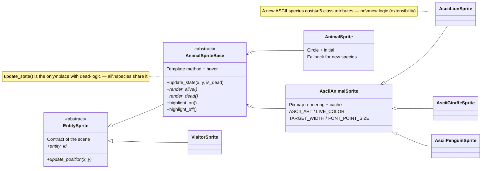
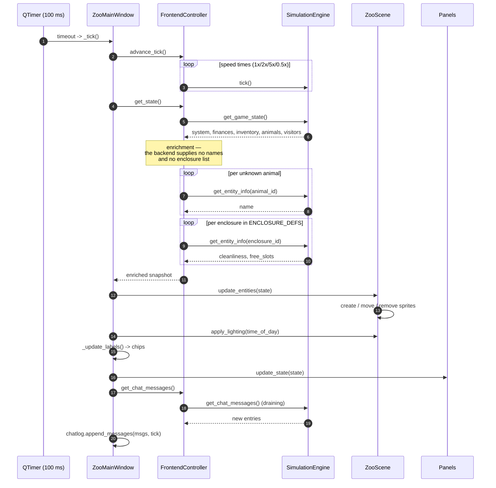
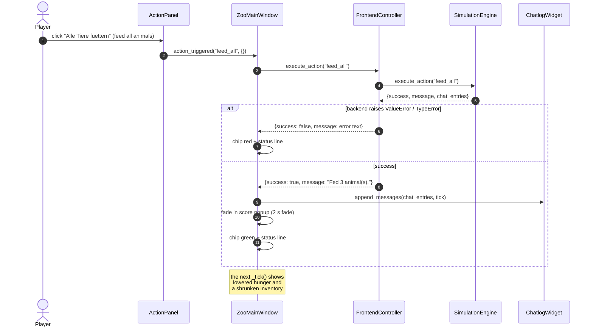
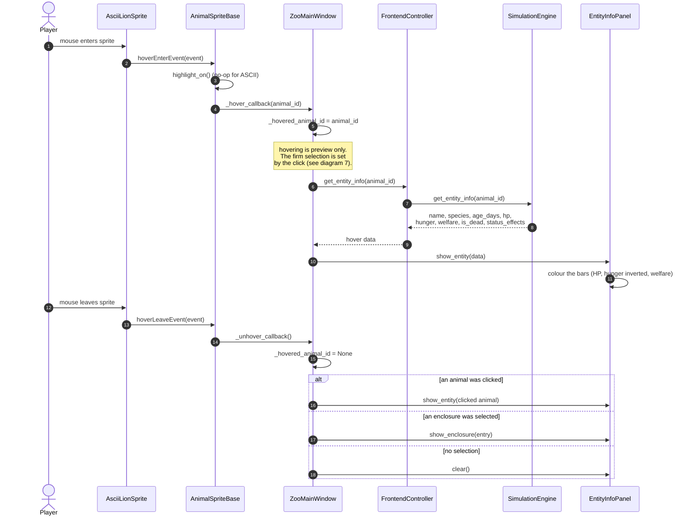
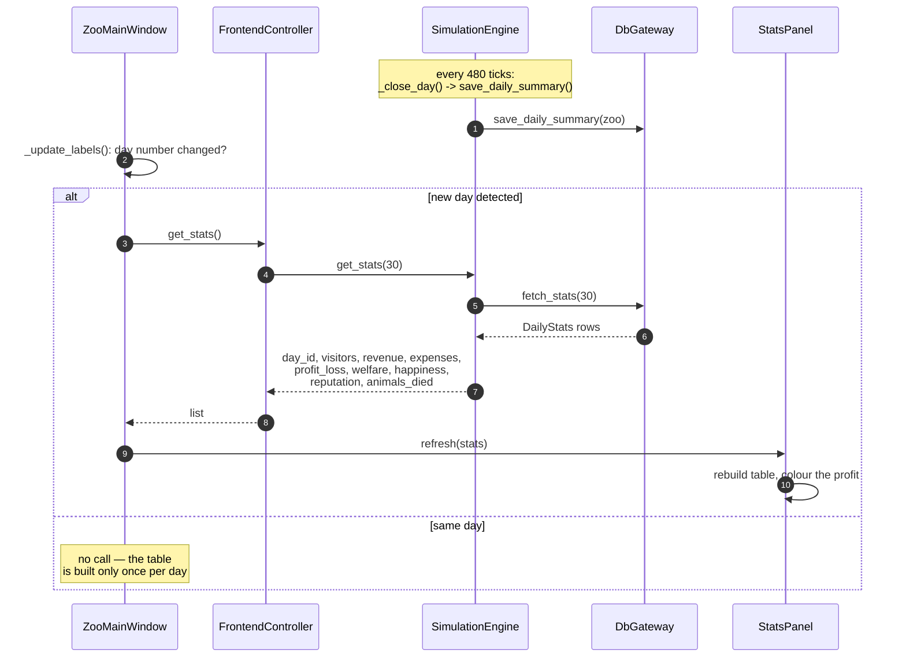
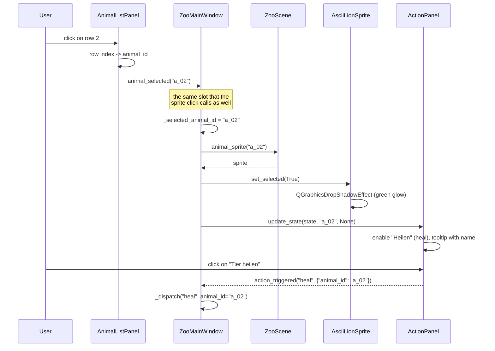
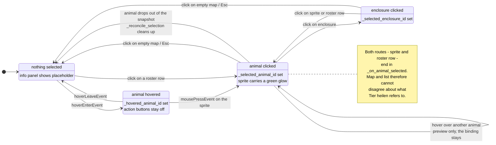
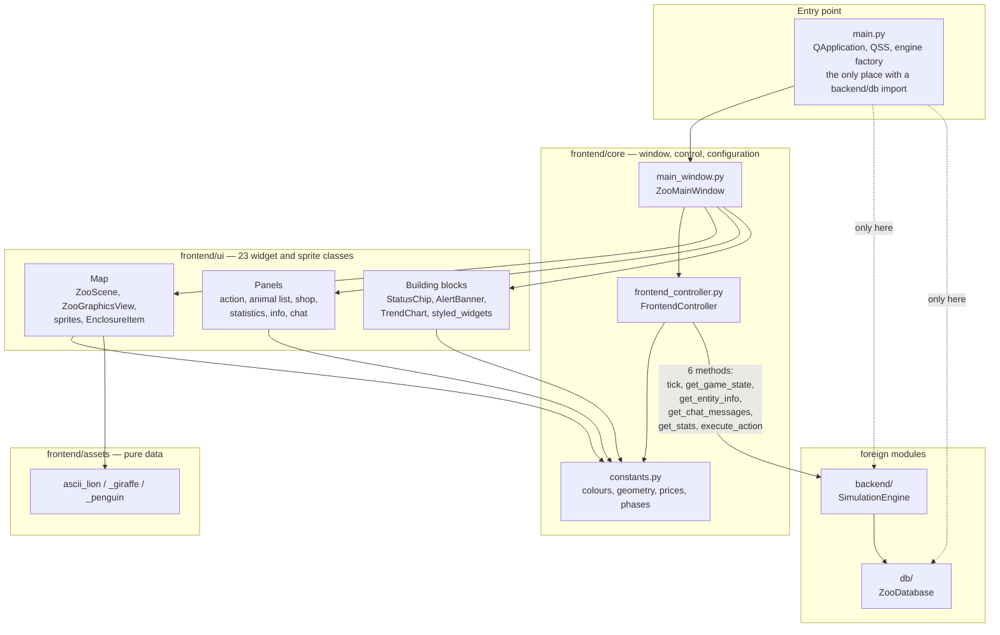

# 🏗️ Frontend — class and sequence diagrams

> **Module:** Frontend · **Module owner:** Erik
> **Assessment criterion:** Design-Visualisierung (Mermaid, 10 Punkte)
> **As of:** 2026-08-09 — matches the code in `frontend/`

This document contains four kinds of diagram:

1. the **class diagram** of all 25 frontend classes (attributes, methods,
   relationships) — §1, plus the **sprite inheritance hierarchy** in detail in §2,
2. five **sequence diagrams** of the most important interactions — §3–§7:
   render loop, feeding action, hover, end of day and selection via the
   animal list,
3. a **state diagram** of the selection — §8: the difference between a
   transient preview and a firm binding, on which three of the bugs that
   actually occurred hinged,
4. a **component diagram** of the layers — §9: where the boundary to the
   backend runs and how it is pinned down in the test.

---

## 1. Class diagram (overall view)

```mermaid
classDiagram
    direction TB

    %% ────────── Core layer ──────────
    class ZooMainWindow {
        -_controller: FrontendController
        -_scene: ZooScene
        -_view: ZooGraphicsView
        -_action_panel: ActionPanel
        -_animal_list: AnimalListPanel
        -_shop_panel: ShopPanel
        -_stats_panel: StatsPanel
        -_entity_info: EntityInfoPanel
        -_chatlog: ChatlogWidget
        -_tabs: QTabWidget
        -_alert_banner: AlertBanner
        -_chip_day, _chip_phase: StatusChip
        -_chip_budget, _chip_revenue: StatusChip
        -_chip_expenses, _chip_ticket: StatusChip
        -_chip_open, _chip_animals: StatusChip
        -_chip_visitors, _chip_enclosures: StatusChip
        -_chip_action: StatusChip
        -_btn_pause, _btn_speed: QPushButton
        -_lbl_status: QLabel
        -_shortcuts: list~QShortcut~
        -_timer: QTimer
        -_action_msg_timer: QTimer
        -_last_action_msg: str|None
        -_state: dict
        -_score_label: QLabel
        -_score_opacity: QGraphicsOpacityEffect
        -_score_anim: QPropertyAnimation|None
        -_hovered_animal_id: str|None
        -_selected_animal_id: str|None
        -_selected_enclosure_id: str|None
        -_marked_animal_id: str|None
        -_last_day: int
        -_frame: int
        -_roster_ids: list~str~
        +clock_minutes(ticks: int)$ int
        -_build_ui() void
        -_build_menu() void
        -_build_top_bar() QFrame
        -_build_body() QWidget
        -_scrollable(panel: QWidget)$ QScrollArea
        -_build_bottom_bar() QFrame
        -_place_overlays() void
        -_make_pause_button() QPushButton
        -_make_speed_button() QPushButton
        -_pause_qss(running: bool)$ str
        -_connect_signals() void
        -_setup_accessibility() void
        -_register_shortcuts() void
        -_wire_sprite_callbacks() void
        -_tick() void
        -_reconcile_selection(state: dict) void
        -_update_sprites(state: dict) void
        -_update_labels(state: dict) void
        -_update_clock_chips(system: dict) int
        -_update_finance_chips(finances: dict, zoo_open: bool) void
        -_update_population_chips(animals, visitors, enclosures) int
        -_update_panels(state: dict, force_roster: bool) void
        -_refresh_roster(state: dict, force: bool) void
        -_refresh_info_panel() void
        -_enclosure_entry(enclosure_id: str) dict|None
        -_on_hover(entity_id: str) void
        -_on_unhover() void
        -_on_animal_selected(entity_id: str) void
        -_mark_selected_sprite(entity_id: str|None) void
        -_on_enclosure_selected(enclosure_id: str) void
        -_on_map_clicked(x: float, y: float) void
        -_dispatch(action: str, kwargs) void
        -_dispatch_selected(action: str) void
        -_clean_selected() void
        -_show_score_popup(action: str, message: str) void
        -_clear_action_message() void
        -_show_help() void
        -_toggle_pause() void
        -_cycle_speed() void
    }

    class FrontendController {
        -_engine: SimulationEngine
        -_paused: bool
        -_speed: float
        -_tick_budget: float
        -_name_cache: dict~str,str~
        -_pending_chat: list~dict~
        +advance_tick() int
        +toggle_pause() bool
        +cycle_speed() float
        +paused: bool
        +speed: float
        +get_state() dict
        +get_entity_info(entity_id: str) dict|None
        +get_animal_details(state: dict|None) list~dict~
        +get_animal_name(animal_id: str) str
        +get_chat_messages() list~dict~
        +get_stats(days_back: int) list~dict~
        +execute_action(action: str, kwargs) dict
        -_attach_animal_names(state: dict) void
        -_collect_enclosures() list~dict~
        -_drain_engine_chat() void
    }

    class SimulationEngine {
        <<external backend>>
        +tick() void
        +get_game_state() dict
        +get_entity_info(id: str) dict
        +get_chat_messages() list~dict~
        +execute_action(action: str, kwargs) dict
        +get_stats(days_back: int) list~dict~
    }

    class constants {
        <<module · single source of configuration>>
        +WINDOW_W, WINDOW_H: int
        +WINDOW_MIN_W, WINDOW_MIN_H: int
        +MAP_W, MAP_H: int
        +TICK_MS, TICKS_PER_DAY: int
        +SPEED_STEPS: tuple
        +SPECIES_COLORS, SPECIES_LABELS: dict
        +SPECIES_FOOD, FOOD_PRICES: dict
        +ANIMAL_PRICES, INVENTORY_KEYS: dict
        +ENCLOSURE_DEFS: list
        +PHASE_LIGHTING, PHASE_LABELS: dict
        +ROSTER_COLUMNS, ROSTER_FILTERS: tuple
        +ROSTER_REFRESH_FRAMES: int
        +TREND_METRICS: tuple
        +VALUE_WARN, VALUE_CRITICAL: float
        +VALUE_MARKERS, CHAT_FILTERS: dict
        +ALERT_TYPES, ALERT_FRAMES
        +Z_* drawing layers
        +C_* colour palette
    }

    %% ────────── Map layer ──────────
    class ZooScene {
        -_animals: dict~str,AnimalSpriteBase~
        -_visitors: dict~str,VisitorSprite~
        -_enclosures: dict~str,EnclosureItem~
        -_particles: list~AmbientParticle~
        -_lighting_overlay: QGraphicsRectItem
        -_lighting_colour: QColor
        -_lighting_anim: QVariantAnimation
        -_phase: str
        +apply_lighting(phase: str, zoo_open: bool) void
        +update_entities(game_state: dict) void
        +animal_sprite(animal_id: str) AnimalSpriteT|None
        +animals dict
        +enclosures dict
        -_update_animals(animals: list) void
        -_update_visitors(visitors: list) void
        -_update_enclosures(enclosures: list) void
        -_make_sprite(animal: dict) AnimalSpriteBase
        -_create_enclosures() void
        -_build_grid_brush() QBrush
        -_on_lighting_step(value: QColor) void
    }

    class ZooGraphicsView {
        <<QGraphicsView>>
        -_scene: ZooScene
        +map_clicked: Signal(float,float)
        +resized: Signal()
        +wheelEvent(event) void
        +resizeEvent(event) void
        +mousePressEvent(event) void
        +zoo_scene ZooScene
    }

    %% ────────── Sprite hierarchy ──────────
    class EntitySprite {
        <<abstract>>
        +update_position(x: float, y: float)* void
        +entity_id str
    }

    class AnimalSpriteBase {
        <<abstract>>
        #_animal_id: str
        #_name: str
        #_is_dead: bool
        #_hovered: bool
        #_selected: bool
        #_hover_callback: Callable
        #_unhover_callback: Callable
        #_click_callback: Callable
        +init_animal(animal_id: str, name: str) void
        +set_hover_callback(cb: Callable) void
        +set_unhover_callback(cb: Callable) void
        +set_click_callback(cb: Callable) void
        +set_selected(selected: bool) void
        +update_state(x: float, y: float, is_dead: bool) void
        +render_alive()* void
        +render_dead()* void
        +highlight_on() void
        +highlight_off() void
        +mousePressEvent(event) void
        +hoverEnterEvent(event) void
        +hoverLeaveEvent(event) void
        +entity_id str
        +animal_id str
        +name str
        +is_dead bool
        +is_selected bool
    }

    class AsciiAnimalSprite {
        +ASCII_ART: str
        +LIVE_COLOR: str
        +TARGET_WIDTH: int
        +FONT_POINT_SIZE: int
        +SPECIES_LABEL: str
        +update_position(x, y) void
        +render_alive() void
        +render_dead() void
        -_pixmap_for(color: str)$ QPixmap
        -_render_pixmap(color: str)$ QPixmap
        -_recentre_offset() void
    }

    class AsciiLionSprite {
        +ASCII_ART : ASCII_LION
        +LIVE_COLOR : SPECIES_COLORS lion
        +TARGET_WIDTH : 100 px
        +FONT_POINT_SIZE : 6 pt
        +SPECIES_LABEL : SPECIES_LABELS lion
    }
    class AsciiGiraffeSprite {
        +ASCII_ART : ASCII_GIRAFFE
        +LIVE_COLOR : SPECIES_COLORS giraffe
        +TARGET_WIDTH : 100 px
        +FONT_POINT_SIZE : 5 pt
        +SPECIES_LABEL : SPECIES_LABELS giraffe
    }
    class AsciiPenguinSprite {
        +ASCII_ART : ASCII_PENGUIN
        +LIVE_COLOR : SPECIES_COLORS penguin
        +TARGET_WIDTH : 120 px
        +FONT_POINT_SIZE : 5 pt
        +SPECIES_LABEL : SPECIES_LABELS penguin
    }

    class AnimalSprite {
        -_species: str
        -_cx, _cy: float
        -_label: QGraphicsTextItem
        +update_position(x, y) void
        +render_alive() void
        +render_dead() void
        +highlight_on() void
        +highlight_off() void
        -_species_colour() str
        -_species_label() str
        -_centre_label() void
    }

    class VisitorSprite {
        -_visitor_id: str
        -_color: str
        +update_position(x, y) void
        +entity_id str
        +visitor_id str
    }

    class EnclosureItem {
        -_enclosure_id: str
        -_name: str
        -_biome: str
        -_capacity: int
        -_current_count: int
        -_cleanliness: float|None
        -_x, _y, _w, _h: float
        -_label: QGraphicsTextItem
        -_click_callback: Callable
        +set_click_callback(cb: Callable) void
        +update_state(current_count: int, cleanliness: float) void
        +mousePressEvent(event) void
        -_centre_label() void
        +enclosure_id str
    }

    class AmbientParticle {
        -_drift_speed: float
        +drift_speed float
        +tick() void
    }

    %% ────────── Panels ──────────
    class ActionPanel {
        +action_triggered: Signal(str, dict)
        -_btn_feed_all: QPushButton
        -_btn_feed_one: QPushButton
        -_btn_heal: QPushButton
        -_btn_clean: QPushButton
        -_hint: QLabel
        -_keys: dict~QPushButton,str~
        -_selected_animal_id: str|None
        -_selected_enclosure_id: str|None
        +update_state(state: dict, animal_id, enclosure_id) void
        -_update_feed_one(animal: dict|None, inventory: dict) void
        -_update_heal(animal: dict|None) void
        -_update_clean(enclosures: list~dict~) void
        -_emit_selected(action: str) void
        -_emit_enclosure(action: str) void
        -_set_hint(button: QPushButton, text: str) void
    }

    class ShopPanel {
        +buy_food: Signal(str, int)
        +buy_animal: Signal(str, str, str)
        -_money: float
        -_enclosures: list~dict~
        -_food_combo: QComboBox
        -_food_spin: QSpinBox
        -_food_total: QLabel
        -_food_inv_label: QLabel
        -_btn_buy_food: QPushButton
        -_animal_combo: QComboBox
        -_name_edit: QLineEdit
        -_enclosure_combo: QComboBox
        -_enclosure_info: QLabel
        -_btn_buy_animal: QPushButton
        +update_state(state: dict) void
        -_build_food_section() QGroupBox
        -_build_animal_section() QGroupBox
        -_update_food_total() void
        -_refresh_enclosure_info() void
        -_refresh_buttons() void
        -_on_buy_food() void
        -_on_buy_animal() void
    }

    class AnimalListPanel {
        +animal_selected: Signal(str)
        -_table: QTableWidget
        -_filter_combo: QComboBox
        -_hint: QLabel
        -_legend: QLabel
        -_row_ids: list~str~
        +refresh(animals: list~dict~, selected_id: str|None) void
        -_rebuild(animals: list~dict~) void
        -_rows_by_id() dict~str,int~
        -_fill_row(row: int, animal: dict) void
        -_value_cell(row, column, shown, graded) void
        -_apply_filter() void
        -_row_needs_attention(row: int) bool
        -_apply_selection(selected_id: str|None) void
        -_text_cell(row: int, column: int) QTableWidgetItem
        -_on_cell_clicked(row: int, column: int) void
        -_as_float(value)$ float
        -_grade(value: float)$ tuple~str,str~
    }

    class NumericTableItem {
        <<QTableWidgetItem>>
        -_value: float
        +set_value(text: str, value: float) void
        +__lt__(other) bool
        +value float
    }

    class StatsPanel {
        -_summary: QLabel
        -_hint: QLabel
        -_metric_combo: QComboBox
        -_chart: TrendChart
        -_table: QTableWidget
        -_stats: list~dict~
        -_day_count: int
        +refresh(stats: list~dict~) void
        -_on_metric_changed() void
        -_selected_metric() str
        -_set_cell(row, column, text, colour) void
        +day_count int
    }

    class TrendChart {
        -_values: list~float~
        -_metric: str
        -_label: str
        +set_days(stats: list~dict~, metric: str|None) void
        +paintEvent(event) void
        -_scale(height: float) tuple~float,float~
        -_paint_bars(painter: QPainter) void
        -_update_tooltip() void
        +day_count int
        +metric_key str
    }

    class EntityInfoPanel {
        -_placeholder: QLabel
        -_animal_box: QWidget
        -_lbl_name: QLabel
        -_lbl_age: QLabel
        -_lbl_status: QLabel
        -_lbl_effects: QLabel
        -_hp_bar: QProgressBar
        -_hunger_bar: QProgressBar
        -_welfare_bar: QProgressBar
        -_enclosure_box: QWidget
        -_lbl_enc_name: QLabel
        -_lbl_enc_biome: QLabel
        -_lbl_enc_slots: QLabel
        -_clean_bar: QProgressBar
        +show_entity(data: dict|None) void
        +show_enclosure(data: dict|None) void
        +clear() void
        -_make_bar(fmt: str, accent: str)$ QProgressBar
        -_bar_qss(accent: str)$ str
        -_grade(value: float)$ str
    }

    class ChatlogWidget {
        -_entries: list~tuple~
        -_header: QLabel
        -_filter_combo: QComboBox
        -_btn_clear: QPushButton
        -_text_edit: QTextEdit
        +append_messages(messages: list, current_tick: int) void
        +format_timestamp(tick_count)$ str
        +clear() void
        -_accepts(severity: str) bool
        -_render() void
        -_update_header() void
        +entry_count int
    }

    class StatusChip {
        -_accent: str
        +icon_label: QLabel
        +value_label: QLabel
        +set_value(text: str) void
        +set_accent(color: str) void
        +set_icon(text: str) void
    }

    class AlertBanner {
        -_icon: QLabel
        -_label: QLabel
        -_frames_left: int
        +push(messages: list~dict~) bool
        +show_alert(severity: str, text: str) void
        +tick() void
        +frames_left int
    }

    class HelpDialog {
        +shortcut_lines()$ list~str~
        +legend_lines()$ list~str~
        -_section(title: str)$ QLabel
        -_body()$ str
    }

    class help_dialog {
        <<module · constants>>
        +SHORTCUTS: tuple~str,str,str~
        -_LEGEND: tuple~str,str~
    }

    class assets {
        <<package · pure data>>
        +ASCII_LION: str
        +ASCII_GIRAFFE: str
        +ASCII_PENGUIN: str
    }

    class styled_widgets {
        <<module · factories>>
        +panel_layout(panel, spacing, margin) QVBoxLayout
        +styled_button(text, accent, small) QPushButton
        +styled_label(text, dim, bold) QLabel
    }

    %% ────────── Inheritance ──────────
    AnimalSpriteBase --|> EntitySprite
    AsciiAnimalSprite --|> AnimalSpriteBase
    AnimalSprite --|> AnimalSpriteBase
    AsciiLionSprite --|> AsciiAnimalSprite
    AsciiGiraffeSprite --|> AsciiAnimalSprite
    AsciiPenguinSprite --|> AsciiAnimalSprite
    VisitorSprite --|> EntitySprite

    AsciiAnimalSprite --|> QGraphicsPixmapItem
    AnimalSprite --|> QGraphicsEllipseItem
    VisitorSprite --|> QGraphicsEllipseItem
    AmbientParticle --|> QGraphicsEllipseItem
    EnclosureItem --|> QGraphicsRectItem
    ZooScene --|> QGraphicsScene
    ZooGraphicsView --|> QGraphicsView
    ZooMainWindow --|> QMainWindow
    ActionPanel --|> QWidget
    AnimalListPanel --|> QWidget
    NumericTableItem --|> QTableWidgetItem
    ShopPanel --|> QWidget
    StatsPanel --|> QWidget
    TrendChart --|> QWidget
    ChatlogWidget --|> QWidget
    EntityInfoPanel --|> QGroupBox
    StatusChip --|> QFrame
    AlertBanner --|> QFrame
    HelpDialog --|> QDialog

    %% ────────── Composition (lifetime bound) ──────────
    ZooMainWindow *-- FrontendController : owns 1
    ZooMainWindow *-- ZooScene : owns 1
    ZooMainWindow *-- ZooGraphicsView : owns 1
    ZooMainWindow *-- ActionPanel : owns 1
    ZooMainWindow *-- AnimalListPanel : owns 1
    ZooMainWindow *-- ShopPanel : owns 1
    ZooMainWindow *-- StatsPanel : owns 1
    ZooMainWindow *-- EntityInfoPanel : owns 1
    ZooMainWindow *-- ChatlogWidget : owns 1
    ZooMainWindow *-- AlertBanner : owns 1
    ZooMainWindow *-- StatusChip : owns 11
    ZooMainWindow ..> HelpDialog : opens on F1
    StatsPanel *-- TrendChart : owns 1
    ZooGraphicsView *-- ZooScene : renders 1

    %% ────────── Aggregation (managed collections) ──────────
    ZooScene o-- AnimalSpriteBase : manages 0..*
    ZooScene o-- VisitorSprite : manages 0..*
    ZooScene o-- EnclosureItem : manages 0..*
    ZooScene o-- AmbientParticle : manages 30

    %% ────────── Association / dependency ──────────
    FrontendController --> SimulationEngine : calls API
    FrontendController ..> constants : reads ENCLOSURE_DEFS
    ZooMainWindow ..> constants : reads theme + phases
    AsciiAnimalSprite ..> constants : reads colours
    AsciiLionSprite ..> constants : SPECIES_COLORS, SPECIES_LABELS
    AsciiLionSprite ..> assets : ASCII_LION
    AsciiGiraffeSprite ..> assets : ASCII_GIRAFFE
    AsciiPenguinSprite ..> assets : ASCII_PENGUIN
    EnclosureItem ..> constants : reads biomes
    ActionPanel ..> styled_widgets : creates buttons
    ShopPanel ..> styled_widgets : creates buttons/labels
    ChatlogWidget ..> styled_widgets : creates clear button
    AnimalListPanel ..> styled_widgets : creates layout
    StatsPanel ..> styled_widgets : creates layout
    AnimalListPanel ..> constants : reads ROSTER_COLUMNS
    AnimalListPanel ..> NumericTableItem : creates value cells
    TrendChart ..> constants : reads TREND_METRICS
    AlertBanner ..> constants : reads ALERT_TYPES
    ZooMainWindow ..> help_dialog : reads SHORTCUTS for the bindings
    HelpDialog ..> help_dialog : prints SHORTCUTS as help text
```

> **On the relationship `ZooMainWindow ..> HelpDialog`:** it runs in both
> directions through the same tuple. `help_dialog.SHORTCUTS` is at once the
> binding table from which `_register_shortcuts()` creates the `QShortcut`
> objects, and the source of the help text that is displayed. A key therefore
> cannot exist undocumented, and a documented key cannot be missing.

---

## 2. Sprite hierarchy in detail

The core of inheritance/polymorphism in the frontend. `update_state()` is a
**template method**: it exists exactly once in `AnimalSpriteBase`, detects
the transition alive ↔ dead and calls the hooks `render_alive()` /
`render_dead()`, which every subclass implements differently.



---

## 3. Sequence diagram — render loop (tick)



---

## 4. Sequence diagram — the "Alle Tiere füttern" action (feed all animals)



---

## 5. Sequence diagram — hovering over an animal



---

## 6. Sequence diagram — end of day and statistics



---

## 7. Sequence diagram — selection via the animal list

The second route to the same selection. It exists because the backend puts all
animals on the same coordinate, which makes individual sprites almost
impossible to hit. What matters is that both routes end in **the same** method
— otherwise map and list could disagree about what "Tier heilen" (heal animal)
refers to.



---

## 8. State diagram — the selection

Three of the bugs this project actually had sat exactly here. The reason is
that there are **two** selection states that are easily confused:
`_hovered_animal_id` is a transient preview, `_selected_animal_id` a firm
binding. Hovering must not select — otherwise the selection is lost on the way
to the action button, because the pointer leaves the sprite.



| State | "Ausgewähltes füttern" / "Tier heilen" (feed selected / heal animal) | "Gehege reinigen" (clean enclosure) |
|---|---|---|
| Empty | off | off |
| Preview | off | off |
| Animal | **on** (if alive and the food matches) | off |
| Enclosure | off | **on** |

---

## 9. Component diagram — the layers

What is drawn here as an arrow is machine-enforced:
[`tests/test_layering.py`](../tests/test_layering.py) parses every production
file via AST and turns the run red as soon as a `backend` or `db` import
appears outside `main.py`, or as soon as a `ui` module imports the main window.



The arrows point downwards and to the right only. What does **not** exist: an
arrow from `ui/` back to `core/` — no widget imports the main window, they
report back via `pyqtSignal` (widgets) or callbacks (sprites, which as a
`QGraphicsItem` in Qt6 are not allowed to have signals).

**The one narrow seam:** the whole frontend talks to the backend through
exactly six methods, and exclusively through the `FrontendController`. No
widget knows the engine. That is why the application also starts without a
backend — `FrontendController(None)` returns empty answers, the window shows a
notice instead of crashing, and the 229 tests run against a `FakeEngine`
instead of a real simulation.

---

## 10. Legend

| Symbol | Meaning | Example |
|---|---|---|
| `--\|>` | inheritance | `AsciiLionSprite --\|> AsciiAnimalSprite` |
| `*--` | composition (lifetime bound) | `ZooMainWindow *-- ZooScene` |
| `o--` | aggregation (managed collection) | `ZooScene o-- VisitorSprite` |
| `-->` | association | `FrontendController --> SimulationEngine` |
| `..>` | dependency | `ActionPanel ..> styled_widgets` |
| `*` after a method | abstract | `render_alive()*` |
| `$` after a method | static / class method | `_pixmap_for()$` |
| `+` / `-` / `#` | public / private / protected | `+refresh()`, `-_table`, `#_animal_id` |
| `~T~` | generic type | `dict~str,AnimalSpriteBase~` |
| `<<…>>` | stereotype: module, abstract, external | `<<external backend>>` |

### Completeness

The class diagram shows all **25** frontend classes, plus four boxes for
non-classes (`constants`, `styled_widgets`, `help_dialog`, `assets`) and the
one foreign class at the seam: `SimulationEngine`, marked as
`<<external backend>>`, because it is Benjamin's work and not mine.

Counted up, that is **350 of 350** attributes and methods from the code — the
diagram leaves nothing out. Checked with an AST script that holds the member
lines from the Mermaid block against `ast.parse()` of every production file;
it lives in `docs/CHANGELOG.md` with the entry of 9 August 2026.

---

## 11. OOP principles — where they are visible in the frontend

| Principle | Implementation |
|---|---|
| **Abstraction** | `EntitySprite` and `AnimalSpriteBase` define contracts without Qt state; `FrontendController` abstracts the entire backend API, no UI module imports `backend.*`. |
| **Inheritance** | Four-level chain `EntitySprite → AnimalSpriteBase → AsciiAnimalSprite → AsciiLionSprite`. The three species classes consist of nothing more than five class attributes. |
| **Polymorphism** | `ZooScene.update_entities()` calls `update_state()` or `update_position()` on all sprites without knowing the concrete class. `update_state()` is a template method with the hooks `render_alive()`/`render_dead()`. `set_selected()` shows the other side of the same coin: **one** implementation in the base class is enough for ellipse *and* pixmap, because a graphics effect works around arbitrary drawings. |
| **Encapsulation** | All internal state is `_private` (`_animals`, `_selected_animal_id`, `_name_cache`, `_tick_budget`); access only via properties (`animals`, `is_dead`, `is_selected`, `entry_count`, `day_count`, `paused`) and methods. Not every property is read by the render path — five are exercised only by the tests today; they describe the contract of the class. |
| **Composition** | `ZooMainWindow` owns all panels and the controller, `StatsPanel` owns its `TrendChart` — close the window and everything disappears. |
| **Aggregation** | `ZooScene` manages sprite dictionaries; sprites come and go with the backend entities, not with the scene. |
| **SRP / one class per file** | 25 classes in 25 files; helper classes such as `StatusChip`, `AmbientParticle` and `TrendChart` were deliberately moved out of `main_window.py`, `zoo_scene.py` and `stats_panel.py` respectively. `tests/test_layering.py` checks the rule via AST. |
| **One source per fact** | The pause lives only in the controller, the key bindings only in `SHORTCUTS`, the prices only in `constants`. Two copies of the same fact drift apart — that happened three times in the course of this project (see `CHANGELOG.md`). |
