# 🏗️ Frontend Class Diagram — vivizoo

> **Mermaid Class Diagram** for the frontend module.  
> Bewertungskriterium: Design-Visualisierung (10 Punkte)

```mermaid
classDiagram
    direction TB

    %% ── Entry Point ──
    class QApplication {
        <<external>>
    }

    %% ── Core Layer ──
    class ZooMainWindow {
        -_controller: FrontendController
        -_scene: ZooScene
        -_view: ZooGraphicsView
        -_action_panel: ActionPanel
        -_shop_panel: ShopPanel
        -_entity_info_panel: EntityInfoPanel
        -_chatlog: ChatlogWidget
        -_event_banner: EventBanner
        -_timer: QTimer
        -_selected_animal_id: str | None
        -_selected_enclosure_id: str | None
        -_paused: bool
        +__init__(controller: FrontendController)
        -_build_ui(): void
        -_connect_signals(): void
        -_tick(): void
        -_update_sprites(state: dict): void
        -_update_labels(state: dict): void
        -_update_panels(state: dict): void
        -_on_hover(entity_id: str): void
        -_on_unhover(): void
        -_on_enclosure_selected(enclosure_id: str): void
        -_on_map_clicked(x: float, y: float): void
        -_dispatch(action: str, **kwargs): void
    }

    class FrontendController {
        -_engine: SimulationEngine
        +__init__(engine: SimulationEngine)
        +get_state(): dict
        +get_entity_info(entity_id: str): dict | None
        +get_chat_messages(): list~dict~
        +execute_action(action: str, **kwargs): dict
        +advance_tick(): void
    }

    class SimulationEngine {
        <<external, backend>>
        +tick(): void
        +get_game_state(): dict
        +get_entity_info(id: str): dict
        +get_chat_messages(): list~dict~
        +execute_action(action: str, **kwargs): dict
    }

    %% ── Map Layer ──
    class ZooScene {
        -_animals: dict~str, QGraphicsItem~
        -_visitors: dict~str, VisitorSprite~
        -_enclosures: dict~str, EnclosureItem~
        -_lighting_overlay: QGraphicsRectItem
        +__init__(parent: QWidget?)
        -_create_enclosures(): void
        +apply_lighting(zoo_open: bool): void
        +update_entities(game_state: dict): void
        +clear_all(): void
    }

    class ZooGraphicsView {
        +entity_hovered: Signal(str)
        +entity_unhovered: Signal()
        +map_clicked: Signal(float, float)
        +__init__(scene: ZooScene, parent: QWidget?)
        +wheelEvent(event: QWheelEvent): void
        +mousePressEvent(event: QMouseEvent): void
    }

    %% ── Sprite Hierarchy (Vererbung / Polymorphie) ──
    class BaseEntitySprite {
        <<abstract>>
        #_entity_id: str
        #_x: float
        #_y: float
        +__init__(entity_id: str, x: float, y: float)
        +update_position(x: float, y: float)* void
        +set_dead_state(is_dead: bool)* void
    }

    class AnimalSprite {
        +entity_hovered: Signal(str)
        +entity_unhovered: Signal()
        -_species: str
        -_name: str
        -_is_dead: bool
        +__init__(animal_id: str, species: str, x: float, y: float, name: str)
        +update_state(x: float, y: float, is_dead: bool): void
        -_render_alive(): void
        -_render_dead(): void
        +hoverEnterEvent(event): void
        +hoverLeaveEvent(event): void
    }

    class AsciiLionSprite {
        <<ASCII Pixmap>>
        -_pixmap: QPixmap
        -_name: str
        -_is_dead: bool
        +__init__(animal_id: str, x: float, y: float, name: str)
        +set_hover_callback(cb: Callable): void
        +set_unhover_callback(cb: Callable): void
        +update_state(x: float, y: float, is_dead: bool): void
        +animal_id(): str
        +hoverEnterEvent(event): void
        +hoverLeaveEvent(event): void
    }

    class AsciiPenguinSprite {
        <<ASCII Pixmap>>
        -_pixmap: QPixmap
        -_name: str
        -_is_dead: bool
        +__init__(animal_id: str, x: float, y: float, name: str)
        +set_hover_callback(cb: Callable): void
        +set_unhover_callback(cb: Callable): void
        +update_state(x: float, y: float, is_dead: bool): void
        +animal_id(): str
        +hoverEnterEvent(event): void
        +hoverLeaveEvent(event): void
    }

    class AsciiGiraffeSprite {
        <<ASCII Pixmap>>
        -_pixmap: QPixmap
        -_name: str
        -_is_dead: bool
        +__init__(animal_id: str, x: float, y: float, name: str)
        +set_hover_callback(cb: Callable): void
        +set_unhover_callback(cb: Callable): void
        +update_state(x: float, y: float, is_dead: bool): void
        +animal_id(): str
        +hoverEnterEvent(event): void
        +hoverLeaveEvent(event): void
    }

    class VisitorSprite {
        -_color: QColor
        +__init__(visitor_id: str, x: float, y: float)
        +update_state(x: float, y: float): void
    }

    class EnclosureItem {
        +enclosure_clicked: Signal(str)
        -_capacity: int
        -_current_count: int
        +__init__(enclosure_id: str, name: str, biome: str, x: float, y: float, w: float, h: float, capacity: int)
        +update_state(current_count: int): void
        +mousePressEvent(event): void
    }

    %% ── UI Panels ──
    class ActionPanel {
        +action_triggered: Signal(str, dict)
        -_buttons: dict~str, QPushButton~
        +__init__(parent: QWidget?)
        +update_state(state: dict, selected_animal_id: str | None, selected_enclosure_id: str | None): void
        -_on_button_clicked(action_name: str): void
    }

    class ShopPanel {
        +buy_food: Signal(str, int)
        +buy_animal: Signal(str)
        -_food_combo: QComboBox
        -_food_spin: QSpinBox
        -_animal_combo: QComboBox
        +__init__(parent: QWidget?)
        +update_state(state: dict): void
        -_on_buy_food(): void
        -_on_buy_animal(): void
    }

    class EntityInfoPanel {
        -_labels: dict~str, QLabel~
        -_progress_bars: dict~str, QProgressBar~
        +__init__(parent: QWidget?)
        +show_entity(data: dict | None): void
        -_clear_to_placeholder(): void
    }

    class ChatlogWidget {
        -_text_edit: QTextEdit
        -_message_count: int
        +__init__(parent: QWidget?)
        +append_messages(messages: list~dict~): void
        +clear(): void
        -_trim_to_max(): void
    }

    class EventBanner {
        +__init__(parent: QWidget?)
        +show_event(name: str, days_remaining: int): void
        +hide_event(): void
    }

    %% ── Utilities ──
    class styled_button {
        <<function>>
        +styled_button(text: str, accent?: bool, danger?: bool, small?: bool) QPushButton
    }

    class styled_label {
        <<function>>
        +styled_label(text?: str, dim?: bool, large?: bool, bold?: bool, color?: str, size?: int) QLabel
    }

    class constants {
        <<module>>
        +MAP_W: int = 800
        +MAP_H: int = 600
        +TICK_MS: int = 100
        +SPECIES_COLORS: dict
        +ENCLOSURE_DEFS: list
        +C_BG_DEEP: str
        +C_ACCENT: str
        ...all color constants
    }

    %% ── Relationships ──

    %% Inheritance (Vererbung)
    AnimalSprite --|> QGraphicsEllipseItem
    AsciiLionSprite --|> QGraphicsPixmapItem
    AsciiPenguinSprite --|> QGraphicsPixmapItem
    AsciiGiraffeSprite --|> QGraphicsPixmapItem
    VisitorSprite --|> QGraphicsEllipseItem
    EnclosureItem --|> QGraphicsRectItem
    ZooScene --|> QGraphicsScene
    ZooGraphicsView --|> QGraphicsView
    ZooMainWindow --|> QMainWindow
    ActionPanel --|> QWidget
    ShopPanel --|> QWidget
    EntityInfoPanel --|> QGroupBox
    ChatlogWidget --|> QWidget
    EventBanner --|> QFrame

    %% Composition (Komposition) — contained objects die with owner
    ZooMainWindow *-- ZooScene : "owns (1)"
    ZooMainWindow *-- ZooGraphicsView : "owns (1)"
    ZooMainWindow *-- ActionPanel : "owns (1)"
    ZooMainWindow *-- ShopPanel : "owns (1)"
    ZooMainWindow *-- EntityInfoPanel : "owns (1)"
    ZooMainWindow *-- ChatlogWidget : "owns (1)"
    ZooMainWindow *-- EventBanner : "owns (1)"
    ZooMainWindow *-- FrontendController : "owns (1)"
    ZooGraphicsView *-- ZooScene : "renders (1)"

    %% Aggregation (Aggregation) — contained objects can outlive owner
    ZooScene o-- AnimalSprite : "manages (0..*)"
    ZooScene o-- AsciiLionSprite : "manages (0..*)"
    ZooScene o-- AsciiPenguinSprite : "manages (0..*)"
    ZooScene o-- AsciiGiraffeSprite : "manages (0..*)"
    ZooScene o-- VisitorSprite : "manages (0..*)"
    ZooScene o-- EnclosureItem : "manages (0..*)"

    %% Association (Assoziation)
    FrontendController --> SimulationEngine : "calls API"
    ZooMainWindow --> constants : "uses"
    AnimalSprite --> constants : "uses colors"
    EnclosureItem --> constants : "uses positions"
    ZooScene --> constants : "uses"

    %% Dependency (Dependency) — factory functions
    ActionPanel ..> styled_button : "creates via"
    ShopPanel ..> styled_button : "creates via"
    ShopPanel ..> styled_label : "creates via"
    EntityInfoPanel ..> styled_label : "creates via"

    %% Polymorphic Note
    note for AsciiPenguinSprite "Polymorphic zu AnimalSprite:\nAlle ASCII-Sprites haben dieselbe\nSchnittstelle: update_state, hover_callbacks"
```

---

## Relationship Legend

| Symbol | Meaning | Example |
|--------|---------|---------|
| `--|>` | Inheritance (Vererbung) | `AnimalSprite --|> QGraphicsEllipseItem` |
| `*--` | Composition (Komposition) | `ZooMainWindow *-- ZooScene` |
| `o--` | Aggregation (Aggregation) | `ZooScene o-- AnimalSprite` |
| `-->` | Association (Assoziation) | `FrontendController --> SimulationEngine` |
| `..>` | Dependency (Dependency) | `ActionPanel ..> styled_button` |

## OOP Principles Demonstrated

| Principle | Where |
|-----------|-------|
| **Vererbung** | `AnimalSprite`, `AsciiLionSprite`, `VisitorSprite` all inherit from Qt base classes. `AsciiLionSprite` is polymorphic with `AnimalSprite` (same interface, different rendering). |
| **Polymorphie** | `ZooScene.update_entities()` iterates over `dict[str, QGraphicsItem]` and calls `.update_state()` — works for any sprite type. |
| **Kapselung** | All internal state is `_private`. UI classes don't touch backend data directly — always through `FrontendController`. |
| **Komposition** | `ZooMainWindow` OWNS all its child widgets. If the window closes, everything is destroyed (lifetime bound). |
| **Aggregation** | `ZooScene` MANAGES sprites, but sprites can be moved between scenes or exist temporarily. |
| **Abstraktion** | `FrontendController` abstracts the backend API. The UI never imports `backend.*` directly. |